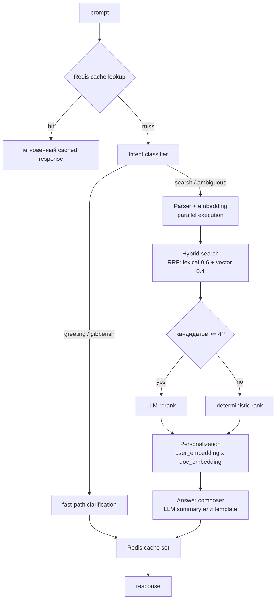
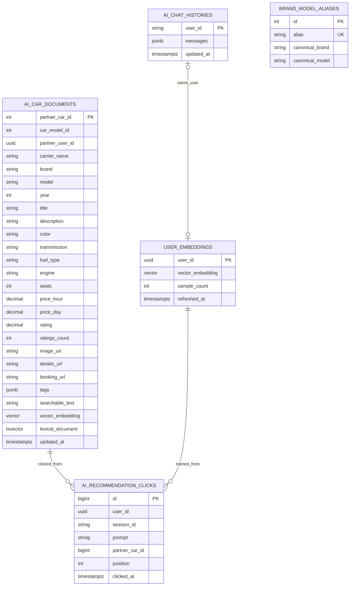

# AI Search Service

Сервис AI-поиска по машинам AutoRent.

Он принимает свободный текст пользователя, извлекает из него структурированные фильтры, выполняет гибридный поиск по заранее проиндексированным машинам и возвращает:

- текст ответа ассистента;
- применённые фильтры;
- список наиболее подходящих машин;
- историю диалога пользователя, если фронт использует chat mode.

## Что делает сервис

Сервис решает четыре задачи:

1. **Online-поиск** и подбор машин по free-text запросу пользователя.
2. **Offline/async индексация** карточек машин в PostgreSQL + pgvector.
3. **Feedback loop**: сбор кликов из AI-подборки для улучшения ранжирования.
4. **Персонализация**: построение user-embeddings из истории взаимодействий и boost релевантных машин.

Основная идея: не ходить в `car-service` с тяжёлыми текстовыми запросами каждый раз, а держать собственный поисковый индекс `ai_car_documents`, в котором уже собраны обогащённый текст, теги и embedding для каждой доступной машины.

## Основные части сервиса

- `src/index.ts` — HTTP entrypoint, маршруты, health/metrics, периодический reindex, graceful shutdown.
- `src/ai/intentClassifier.ts` — fast-path классификатор intent (greeting / gibberish / search / ambiguous) до LLM.
- `src/ai/queryParser.ts` — оркестратор разбора пользовательского запроса, объединяет heuristic и LLM.
- `src/ai/heuristicQueryParser.ts` — rule-based parser для бюджета, мест, коробки, рейтинга, года, бренда и стиля.
- `src/ai/localLlmQueryParser.ts` — извлечение structured filters через локальную LLM с RAG-контекстом.
- `src/ai/openAiQueryParser.ts` — извлечение structured filters через OpenAI-compatible API.
- `src/ai/answerComposer.ts` — формирование текста ответа (clarification + recommendation summary).
- `src/search/searchService.ts` — hybrid retrieval (RRF), фильтрация, rerank, personalization boost.
- `src/search/llmReranker.ts` — опциональный LLM rerank для top-k.
- `src/indexing/searchIndexer.ts` — полная и точечная переиндексация документов.
- `src/messaging/indexingConsumer.ts` — RabbitMQ consumer для событий изменения машин.
- `src/chat/chatHistoryRepository.ts` — чтение и сохранение истории диалога.
- `src/embeddings/*` — провайдеры embedding: local deterministic, local LLM (bge-m3), OpenAI-compatible.
- `src/cache/recommendationCache.ts` — Redis-кэш с in-memory fallback.
- `src/feedback/clickTracking.ts` — запись кликов пользователя из AI-подборки.
- `src/personalization/userEmbeddings.ts` — nightly job для построения user-embeddings, cosine-boost при re-rank.
- `src/queryTaxonomy.ts` — динамические словари брендов/моделей/алиасов из БД.
- `src/tests/llmRecommendations.test.ts` — assertion-based smoke-тесты.
- `src/tests/evalHarness.test.ts` — offline evaluation с метриками recall@k / precision@k / MRR.

## API

### Public

- `POST /recommendations` — получить подборку машин
- `POST /click` — трекинг клика по карточке из подборки
- `GET /history` — история чата (JWT)
- `PUT /history` — сохранение истории (JWT)
- `GET /healthz` — health check
- `GET /metrics` — Prometheus metrics

### Internal

- `POST /internal/reindex` — полный reindex
- `POST /internal/reindex/partner-cars/:partnerCarId` — точечный reindex
- `POST /internal/refresh-user-embeddings` — пересчёт user-embeddings из бронирований и кликов

## Как работает запрос `/recommendations`

### Общая схема обработки



### 1. Входной payload

Сервис ожидает:

- `prompt: string` (обязателен)
- `messages?: AiChatMessage[]` — история для follow-up запросов
- `userId?: string` — опциональный UUID для персонализации

`prompt` обязателен. Если его нет или он пустой, сервис вернёт `400`.

### 2. Redis cache

Перед любой обработкой сервис проверяет Redis-кэш по ключу `ai-search:recommendation:<normalized_prompt>|h=<history_size>`. При hit ответ возвращается за ~10ms.

Кэш:
- TTL: 300 секунд (`REDIS_CACHE_TTL_SECONDS`)
- LRU eviction на уровне Redis (128MB лимит)
- Автоматический fallback на in-memory LRU если Redis недоступен

### 3. Intent classifier

Файл: `src/ai/intentClassifier.ts`

Классификатор смотрит на промпт до вызова LLM и различает:

- **greeting** — "привет", "hello", "здравствуйте" → fast-path: сразу clarification без LLM-парсера (экономия ~20 секунд на одном запросе).
- **gibberish** — случайный набор символов → тоже clarification.
- **search** — найден бренд/модель/стиль/бюджет/год/рейтинг → полный пайплайн.
- **ambiguous** — есть слова, но сигналов нет → пайплайн с упором на clarification.

Детекция основана на:
- regex для greetings/smalltalk
- проверке вхождения токенов против `getBrandDictionary`, `getModelToBrandDictionary`, `getAliasToCanonicalBrand`, `getAliasToCanonicalModel` (загружаются из БД)
- regex-cues для бюджета, года, пассажиров, рейтинга

### 4. Параллельное выполнение parser + embedding

Чтобы не ждать LLM-парсер перед стартом поиска, сервис запускает одновременно:
- `parseRecommendationQuery(prompt, history)` — LLM + heuristic
- `createEmbedding(buildBaseRetrievalPrompt(prompt))` — на базовом промпте без LLM-фильтров

Экономия: до 1-2 секунд на каждом запросе. Если embedding не удался, пайплайн продолжает без него.

### 5. Разбор запроса через `queryParser`

Файл: `src/ai/queryParser.ts` — центральный оркестратор.

Структура `ParsedRecommendationQuery`:

- `prompt`, `maxBudgetPerHour`, `passengers`, `transmission`, `minRating`
- `preferredStyles`, `excludedStyles`, `preferredBrands`
- `minYear`, `maxYear`
- `startTime`, `endTime`, `requiresAvailableOnDates`

#### Первый слой: heuristic parser

Извлекает:
- бюджет в час: `до 10000`, `до 15 тыс`
- количество мест, коробку, рейтинг
- год: `от 2020`, `2021+`, `до 2015`, `между 2018 и 2022`
- стили: `sport`, `business`, `family`, `city`, `luxury`
- исключения: `не спорт`, `без luxury`, `кроме family`
- бренды из динамического словаря `brand_model_aliases`

#### Второй слой: LLM parser с RAG-контекстом

Если задан `LOCAL_LLM_BASE_URL` — используется `localLlmQueryParser`.

Перед вызовом LLM сервис строит RAG-контекст: ищет в `brand_model_aliases` и `ai_car_documents` совпадения с токенами запроса и добавляет их в user message. Это помогает слабой локальной модели (qwen2.5:1.5b) правильно определять бренд для малоизвестных моделей.

System prompt содержит:
- JSON-схему ответа;
- допустимые лейблы стилей и коробок;
- каталог доступных моделей;
- **5 few-shot примеров** против галлюцинаций (для "cobalt", "камри", "привет", "спортивную", "camry автомат");
- абсолютное правило: заполнять поле только если оно явно упомянуто пользователем.

#### reconcile: объединение heuristic + LLM с защитой от галлюцинаций

`reconcileWithHeuristics(...)`:
- LLM — основной источник для большинства полей
- Heuristic имеет приоритет для дат (ISO regex надёжнее)
- **Защитные гарды** отбрасывают LLM-значения, если промпт не содержит ключевых слов:
  - `transmission` принимается только если в промпте есть `автомат`, `механика`, `акпп`, `automatic`, `manual`, `коробк`, `gearbox`
  - `minRating` принимается только если в промпте есть `рейтинг`, `rating`, `звёзд`, `stars`, `оцен`

Эти гарды решают классический кейс: "нужна камри" — LLM галлюцинирует `transmission: manual`, но промпт не содержит transmission-ключевика → отбрасывается.

#### Наследование контекста из истории

Для коротких/продолжающих запросов (`подешевле`, `теперь автомат`, `не спорт`) фильтры наследуются из предыдущего ассистент-сообщения с `appliedFilters`. Для reset-маркеров (`привет`, `новый запрос`) контекст обрывается.

## Hybrid search с Reciprocal Rank Fusion

Файл: `src/search/searchService.ts`

### 1. Query expansion перед retrieval

Функция `computeQueryExpansions(prompt)` превращает запрос в расширенный поисковый prompt:

- алиасы → канонические английские токены: "камри" → "toyota camry", "кобальт" → "chevrolet cobalt"
- модели из каталога → с брендом: "cobalt" → "chevrolet cobalt"

Это закрывает разрыв между кириллическими запросами пользователей и латинскими документами в БД.

### 2. Embedding через bge-m3

`createEmbedding(...)` использует bge-m3 (мультиязычный SOTA, 1024 dim):

1. Если есть `LOCAL_LLM_BASE_URL` — получаем embedding у Ollama;
2. Если локальный embedding упал — deterministic local fallback;
3. Если локальной модели нет, но есть `OPENAI_API_KEY` — OpenAI-compatible;
4. Если всё упало — deterministic local.

**Размерность: 1024.** Исторически в схеме было 128 с обрезкой через `normalizeDimensions` — это уничтожало семантику. После миграции `V4__resize_vector_to_1024` размерность соответствует нативной для bge-m3.

### 3. Hybrid retrieval в PostgreSQL (RRF)

Поиск идёт по таблице `ai_car_documents` через **Reciprocal Rank Fusion**:

```sql
with filtered as (
  select * from ai_car_documents where <hard_filters>
),
vector_ranked as (
  select partner_car_id, row_number() over (order by vector_embedding <=> $embedding) as vec_rank
  from filtered
  order by vector_embedding <=> $embedding
  limit 60
),
lexical_ranked as (
  select partner_car_id, row_number() over (order by ts_rank_cd(lexical_document, $tsquery) desc) as lex_rank
  from filtered
  where lexical_document @@ $tsquery
  order by ts_rank_cd(lexical_document, $tsquery) desc
  limit 60
),
fused as (
  select partner_car_id, sum(score) as rrf_score
  from (
    select partner_car_id, 0.4 / (60 + vec_rank) as score from vector_ranked
    union all
    select partner_car_id, 0.6 / (60 + lex_rank) as score from lexical_ranked
  )
  group by partner_car_id
)
select * from filtered
join fused using (partner_car_id)
order by fused.rrf_score desc
limit 24
```

Ключевые детали:
- **Веса 0.6 lexical + 0.4 vector** — именованные сущности (модели/бренды) лучше различаются BM25, чем слабым локальным embedding'ом.
- Для лексического канала собирается **отдельный набор токенов** через `buildLexicalQueryTokens(...)`: только brands/styles/transmission/expansions, без filler-слов ("нужна", "хочу" и т.п., которые убивают recall с AND-семантикой).
- **OR-семантика** `to_tsquery('simple', 'toyota | camry | sedan')` — любой matching токен активирует канал.
- Hard filters в SQL: бюджет × 1.25, seats ≥ passengers, year bounds, transmission, minRating, preferredBrands.
- Кандидатный пул: 60, финальный лимит: 24.

### 4. Post-processing

- availability filter через `booking-service`
- preferred style filter (мягкий — откат к исходному набору если всё отфильтровалось)
- excluded style filter
- точный budget filter

### 5. Business rerank + Personalization

Для каждого кандидата считаются `vectorScore`, `lexicalScore`, `businessScore`, `finalScore`:

```
finalScore = vectorScore * 0.5 + lexicalScore * 0.2 + businessScore * 0.3
```

`businessScore` повышается за попадание в бюджет, число мест, коробку, рейтинг, стиль, год, высокий рейтинг.

### 6. LLM rerank

`rerankCarsWithLlm` вызывается только при **≥4 кандидатах** (иначе нет смысла). LLM получает топ-10 и возвращает переупорядоченный список ID. Таймаут 5 секунд с fallback на детерминистическую сортировку.

### 7. Personalization boost

Если запрос включает `userId` и в `user_embeddings` есть вектор пользователя:

```
personalBoost = max(0, cosine(user_vec, doc_vec)) * 0.15
finalScore += personalBoost
```

Если cosine > 0.6 — добавляется reason "похоже на ваши прошлые выборы". Детали см. раздел "Персонализация".

## Формирование ответа

Файл: `src/ai/answerComposer.ts`

### Recommendation summary

Если `LLM_RECOMMENDATION_SUMMARY_ENABLED=true`, сервис использует локальную LLM для создания summary на основе топ-6 машин. LLM получает краткую карточку каждой машины (brand, model, year, price, rating, tags) и пишет 1-2 предложения на русском.

Таймаут 5 секунд. При падении — fallback на шаблонный summary.

### Clarification

Для пустых/неопределённых запросов сервис возвращает clarification. LLM генерирует живой ответ с приветствием и уточняющим вопросом. Fallback — детерминированный текст.

## Индексация

Файл: `src/indexing/searchIndexer.ts`

### Полный reindex

`reindexEverything()`:
1. Запрашивает список доступных моделей из `car-service`
2. Для каждой модели — partner cars
3. Для каждой partner car — собирает документ, делает upsert
4. Удаляет из индекса неактивные машины
5. Перезагружает taxonomy из БД

Запускается:
- при старте, если `AUTO_INDEX_ON_STARTUP=true`
- по таймеру `AUTO_REFRESH_INTERVAL_SECONDS`
- через `POST /internal/reindex`

### Обогащённый `searchable_text`

Для каждой машины собирается структурированный текст:

```
<brand> <model> <year>
specs: engine <engine> transmission <trans> fuel <fuel>
style: <price_tier_phrase> <style_phrases>
description: <model_description>
color <color>
features: <feature1>, <feature2>
<seats> seats
by <partner_name>
<tags>
reviews: <top_5_comments>
```

Два helper'а добавляют семантические фразы для лучшего BM25 и embedding:

- `buildStyleNarrative(tags, priceHour)` — "budget city daily commute", "luxury premium high-end"
- `buildSpecsNarrative(modelDetails)` — "engine 2.5L transmission Automatic fuel Petrol"

Эти natural-language фразы даёт более сильный сигнал чем plain список тегов.

### Точечный reindex

`reindexPartnerCar(partnerCarId)`:
- обновляет один документ;
- удаляет, если машина неактивна.

Вызывается через `POST /internal/reindex/partner-cars/:id` и через RabbitMQ.

## Схема БД



Миграции в `src/Migrations/`:

- **V1** `init_ai_search` — таблица `ai_car_documents` + pgvector
- **V2** `add_ai_chat_histories` — история чата
- **V3** `add_brand_model_aliases` — алиасы брендов/моделей (cyrillic variants)
- **V4** `resize_vector_to_1024` — переход с vector(128) на vector(1024) для bge-m3
- **V5** `add_feedback_tables` — `ai_recommendation_clicks`, `user_embeddings`

### `ai_car_documents`

- бизнес-данные по машине
- JSON теги
- `searchable_text`
- `vector_embedding vector(1024)`
- generated `lexical_document tsvector` (from title + searchable_text)

Индексы: GIN по `lexical_document`, B-tree по `partner_user_id` и `price_hour`, IVFFLAT по `vector_embedding`.

### `brand_model_aliases`

Динамический словарь транслитерации и алиасов — без хардкода в коде.

- `alias TEXT` — "камри", "кобальт", "тойота"
- `canonical_brand TEXT` — "toyota", "chevrolet"
- `canonical_model TEXT NULL` — "camry", "cobalt" (null для brand-only алиасов)

Используется для:
- query expansion при retrieval
- RAG-контекста при LLM parsing
- intent classification

### `ai_chat_histories`

История диалога пользователя: `user_id`, `messages jsonb`, `updated_at`.

### `ai_recommendation_clicks`

Трекинг кликов из AI-подборки:
- `user_id UUID NULL`, `session_id TEXT NULL`
- `prompt TEXT` — оригинальный запрос
- `partner_car_id BIGINT` — на какую машину кликнули
- `position INT` — позиция в списке (0 = первая)
- `clicked_at TIMESTAMPTZ`

### `user_embeddings`

Персональные preference-векторы:
- `user_id UUID PRIMARY KEY`
- `vector_embedding vector(1024)`
- `sample_count INT` — сколько взаимодействий легло в вектор
- `refreshed_at TIMESTAMPTZ`

## Feedback loop

### Click tracking

`POST /click`:
```json
{
  "userId": "uuid | optional",
  "sessionId": "string | optional",
  "prompt": "original query",
  "partnerCarId": 42,
  "position": 2
}
```

Возвращает `202 Accepted`. Запись идёт fire-and-forget.

### Использование сигналов

Клики — это более сильный relevance-сигнал чем чистое "пользователь увидел". Они:
1. Питают построение `user_embeddings` (персонализация)
2. Могут быть использованы для re-ranking: популярные машины в AI-подборке получают boost
3. Служат evaluation-сигналом: если recall@5 высокий, но click-through низкий — ранжирование слабое

## Персонализация

Файл: `src/personalization/userEmbeddings.ts`

### Как строится user-вектор

`refreshUserEmbeddings()`:
1. Собирает все клики из `ai_recommendation_clicks` за последние 90 дней
2. Взвешивает: клики × 1.0, бронирования × 2.0 (когда интеграция будет готова)
3. Группирует по `user_id`
4. Для каждого пользователя с ≥3 взаимодействий:
   - берёт `vector_embedding` документов, с которыми он взаимодействовал
   - считает взвешенный mean → preference vector
5. Upsert в `user_embeddings`

Это content-based подход: пользователь, который кликает на спортивные купе, получит вектор в sport-coupe регионе embedding пространства.

### Re-rank через cosine boost

В `searchCars(...)` после базового ранжирования и LLM-rerank:

```typescript
const similarity = cosineSimilarity(userVector, docVector);
const personalBoost = Math.max(0, similarity) * 0.15;
candidate.finalScore += personalBoost;
```

Буст до 0.15 — умеренный, чтобы не перекрыть smart retrieval полностью.

### Запуск refresh

`POST /internal/refresh-user-embeddings` — можно повесить на cron (раз в день) или вызывать из внешнего scheduler.

## Кэш (Redis)

Файл: `src/cache/recommendationCache.ts`

Каждый успешный ответ кэшируется в Redis по нормализованному ключу:

```
ai-search:recommendation:<lowercase_trimmed_prompt>|h=<history_count>
```

Параметры:
- TTL: 300s (`REDIS_CACHE_TTL_SECONDS`)
- Redis с `maxmemory 128mb` и `allkeys-lru` eviction
- Connection через `ioredis` с `lazyConnect: false`
- При падении Redis — silent fallback на in-memory LRU (200 записей, 5 мин TTL)

Это критично: один cached запрос экономит ~22 секунды LLM-времени. На повторяющихся запросах ("cobalt", "семейная машина") hit-rate высокий.

## Offline evaluation

Файл: `src/tests/evalHarness.test.ts`

Golden set из 30 запросов с разметкой "какие машины релевантны". Метрики:

- **recall@k** — процент релевантных машин в топ-k
- **precision@k** — доля релевантных среди топ-k
- **MRR** — Mean Reciprocal Rank для запросов с `mustAppearFirst`
- **avg/p95 latency**

Запуск:
```bash
npm run eval
```

Baseline после всех улучшений (n=30):
- recall@5 = **0.822**
- precision@5 = **0.770**
- MRR = **0.933**

Используется для детекта регрессий при изменении retrieval, embedding, parser.

## Fine-tuning локальной LLM

Папка: `fine-tuning/`

Для улучшения парсинга малая модель (qwen2.5:1.5b) дообучается через LoRA.

### Датасет

`generate_dataset.py` собирает примеры из 10 секций (~3173 примеров):

- **transliteration** — "хачу кобальт" → `brand: chevrolet`
- **catalog_direct** — прямые названия моделей из каталога
- **year**, **budget**, **styles**, **other_filters** — одиночные фильтры
- **combined** — multi-filter запросы
- **negative** — greetings, gibberish, off-topic → пустые фильтры
- **anti_hallucination** (×3 weight) — промпты с моделью/брендом без других сигналов → фильтры остаются null
- **colloquial** — опечатки, сленг ("шеврик", "мэрс")
- **conversational** — "подешевле", "на выходные" (не leakage в budget)
- **mixed_language** — "нужна camry", "I need камри"
- **negation** — "не хочу спорт", "кроме luxury"

### Тренировка

`train.py` — LoRA fine-tuning через unsloth, bf16, 3 epochs на RTX 3060.

### Экспорт в Ollama

`export_gguf.py` конвертирует в GGUF (Q4_K_M) и загружает в Ollama под именем `autorent-assistant`.

После успешной тренировки меняется env-переменная:
```yaml
LOCAL_LLM_CHAT_MODEL: autorent-assistant
```

## RabbitMQ

Если задан `RABBITMQ_URL`, сервис поднимает consumer:

- queue: `ai-search-service.indexing`
- routing key upsert: `car.search.partner-car-upserted`
- routing key delete: `car.search.partner-car-deleted`

Поведение:
- upsert → `reindexPartnerCar(...)`
- delete → удаление документа
- ошибка → `nack(requeue=false)`

## GPU для Ollama

CPU inference с qwen2.5:1.5b выдаёт ~20 tok/s. LLM-вызовы занимают 15-25 секунд, часто таймаутятся.

GPU (NVIDIA, CUDA) даёт ~200 tok/s — все LLM-шаги укладываются в 1-3 секунды.

Опт-ин через отдельный compose override:

```bash
docker compose -f docker-compose.yml -f docker-compose.gpu.yml up -d
```

Требования:
- Linux: `apt install nvidia-container-toolkit` + `systemctl restart docker`
- Windows: Docker Desktop + WSL2 + up-to-date NVIDIA драйвер

Проверка:
```bash
docker run --rm --gpus all nvidia/cuda:12.4.0-base-ubuntu22.04 nvidia-smi
```

## Метрики и observability

- `GET /healthz`
- `GET /metrics`
- structured logs через `observabilityLogger`

Ключевые события:
- старт/shutdown сервиса
- parser succeeded/failed (local LLM / OpenAI / heuristic)
- embedding succeeded/failed
- hybrid search failure
- LLM rerank succeeded/failed_fallback
- LLM summary succeeded/failed_fallback
- recommendation_cache_hit / redis_connected / redis_error
- recommendation_intent_fast_path
- recommendation_click_recorded
- user_embeddings_refresh_completed
- reindex completed/failure
- chat history load/save
- RabbitMQ indexing failures
- HTTP request completion с latency

## Fallback-стратегия

Сервис деградирует мягко, а не падает целиком.

### Query parsing

1. Local LLM parser с RAG-контекстом
2. OpenAI-compatible parser
3. Heuristic parser

### Embeddings

1. Local LLM (bge-m3) embeddings
2. OpenAI-compatible embeddings
3. Deterministic local embeddings

### Ответ ассистента

1. LLM recommendation summary
2. LLM clarification
3. Deterministic template text

### Кэш

1. Redis
2. In-memory LRU

## Ограничения текущей реализации

- heuristic parser знает только ограниченный словарь стилей
- даты нормально извлекаются в основном через LLM parser
- style tagging зависит от исходных features/transmission/fuelType
- full reindex идёт последовательно и может быть дорогим на большом каталоге
- user_embeddings сейчас только от кликов — бронирования пока не интегрированы
- при каталоге <10 машин collaborative filtering невозможен (требует thousands+ interactions)

## Пример жизненного цикла запроса

Запрос: `Хочу не спорт, автомат, до 12000, рейтинг от 4.5`

1. **Redis**: miss, идём дальше
2. **Intent**: classifier видит `transmission`, `budget`, `rating` → `search`
3. **Parallel**: LLM parser + embedding запускаются параллельно
4. **Heuristic**: `excludedStyles=["sport"]`, `transmission="automatic"`, `maxBudgetPerHour=12000`, `minRating=4.5`
5. **LLM**: подтверждает фильтры, может добавить brand intent
6. **Reconcile**: anti-hallucination гард проверяет — все поля валидны
7. **Query expansion**: если упоминалась модель, добавляется canonical токен
8. **Embedding**: bge-m3 → 1024-dim вектор
9. **SQL hybrid (RRF)**: 60 кандидатов vector + 60 lexical, fusion
10. **Post-filters**: availability + excluded `sport` + exact budget
11. **Business rerank**: finalScore
12. **LLM rerank**: если ≥4 кандидатов
13. **Personalization**: если есть userId — cosine boost
14. **Answer**: LLM summary или template
15. **Redis set**: TTL 300s, ответ

## Environment

См. `.env.example`.

Ключевые переменные:

**DB и шина**
- `DATABASE_URL` — PostgreSQL с pgvector
- `RABBITMQ_URL` — опционально
- `REDIS_URL` — опционально (fallback на in-memory)
- `REDIS_CACHE_TTL_SECONDS` — default 300

**Внешние сервисы**
- `CAR_SERVICE_BASE_URL`, `PARTNER_SERVICE_BASE_URL`, `BOOKING_SERVICE_BASE_URL`
- `API_GATEWAY_PUBLIC_BASE_URL`

**Индексация**
- `AUTO_INDEX_ON_STARTUP`, `AUTO_REFRESH_INTERVAL_SECONDS`

**LLM и embeddings**
- `LOCAL_LLM_BASE_URL`
- `LOCAL_LLM_CHAT_MODEL` — qwen2.5:1.5b или autorent-assistant
- `LOCAL_LLM_EMBEDDING_MODEL` — bge-m3
- `LOCAL_LLM_TIMEOUT_SECONDS`
- `LLM_RECOMMENDATION_SUMMARY_ENABLED`
- `LLM_RECOMMENDATION_SUMMARY_TIMEOUT_MS`
- `OPENAI_API_KEY`, `OPENAI_BASE_URL`, `OPENAI_CHAT_MODEL`, `OPENAI_EMBEDDING_MODEL`

## Скрипты

```bash
npm run build         # tsc
npm run start         # node dist/index.js
npm run dev           # build + start
npm run test:llm      # smoke тесты (12 assertion)
npm run eval          # offline eval с метриками (30 queries)
```
