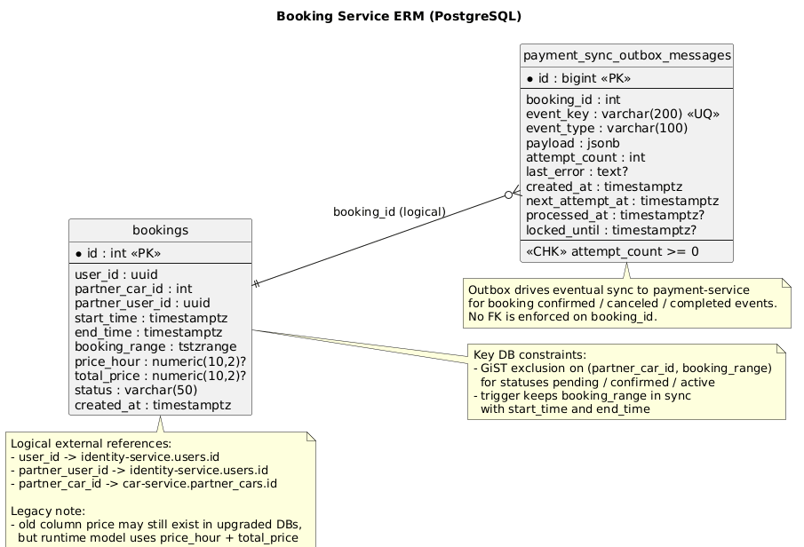

# Booking Service

## Назначение
Сервис бронирований партнерских автомобилей. Отвечает за:
- создание брони по `partnerCarId`;
- получение бронирований текущего пользователя;
- смену статуса (confirm, complete, cancel);
- mock payment flow и price preview;
- completion review с загрузкой 5 фото и advisory-проверкой через `ai-damage-eval-service`;
- создание review/complaint тикетов через `ticket-service`;
- проверку доступности машины по временному интервалу;
- внутренние read-эндпоинты для `car-service`;
- массовую проверку доступности по списку машин (`check-availability`).

## Стек
- ASP.NET Core (`net10.0`)
- PostgreSQL
- Flyway (SQL миграции)
- JWT авторизация
- RabbitMQ outbox для платежной синхронизации

## Важные изменения схемы
Актуальная схема бронирований внедрена в миграции `V3__refactor_bookings_for_car_sharing.sql`:
- `car_id` -> `partner_car_id`;
- `user_id` хранится как `UUID`;
- `start_date/end_date` -> `start_time/end_time` (`TIMESTAMPTZ`);
- добавлены `partner_user_id`, `booking_range`, `price_hour`, `total_price`, `created_at`;
- добавлен exclusion constraint `prevent_overlapping_bookings`:
  - не позволяет пересекать активные брони по одной машине;
  - статусы блокировки: `pending`, `confirmed`, `active`.

### ERM Диаграмма
 

## API
Нативный base path сервиса: `/`.
Через gateway сервис обычно доступен по префиксу `/bookings`.

### Основные маршруты
- `POST /` (policy `bookings:create`)
- `GET /my`
- `GET /my/stats`
- `GET /all`
- `GET /{id:int}`
- `GET /all/{id:int}`
- `POST /{id:int}/cancel`
- `POST /all/{id:int}/cancel`
- `POST /{id:int}/confirm`
- `POST /{id:int}/complete`
- `POST /{id:int}/complete-review`
- `POST /{id:int}/partner-cancel`
- `POST /{id:int}/payment/start`
- `GET /{id:int}/payment/status`
- `POST /{id:int}/payment/submit`
- `GET /{id:int}/charges`
- `POST /{id:int}/charges/{chargeId:long}/pay`
- `GET /price-preview`
- `GET /available?partnerCarId={id}&startTime={iso}&endTime={iso}` (`AllowAnonymous`)

### Internal API (для межсервисного доступа)
Требуется заголовок `X-Internal-Api-Key`.

- `GET /internal/bookings/by-partner-car/{partnerCarId}`
- `GET /internal/bookings/by-car/{partnerCarId}` (alias для обратной совместимости)
- `GET /internal/bookings/counts?partnerCarIds=1,2,3`
- `GET /internal/bookings/counts?carIds=1,2,3` (alias для обратной совместимости)
- `POST /internal/bookings/check-availability`
- `POST /internal/bookings/{id:int}/cancel`
- `POST /internal/bookings/{id:int}/completion-review/approve`
- `POST /internal/bookings/{id:int}/completion-review/fine-issued`
- `POST /internal/bookings/{id:int}/partner-cancellation/approve`
- `POST /internal/bookings/{id:int}/partner-cancellation/reject`

## Интеграции
- `car-service` - snapshot машины, pricing context и проверки доступности.
- `client-service` / `partner-service` - профильный контекст для booking flows.
- `identity-service` - внутренние lookup/provisioning данные.
- `payment-service` - mock payment attempts, charges, ledger, fines и payouts.
- `ticket-service` - review tickets, complaint flows и manager decisions.
- `email-service` - отдельные email-уведомления для booking flows.
- `ai-damage-eval-service` - advisory проверка пяти completion-фото. Интеграция fail-open: при timeout/5xx ticket создается для ручной проверки.
- `RabbitMQ` - async payment sync по статусам бронирования.

## Контракты
### Создание брони (`POST /`)

```json
{
  "partnerCarId": 12,
  "startTime": "2026-03-10T10:00:00Z",
  "endTime": "2026-03-10T14:00:00Z"
}
```

`partnerUserId` и `priceHour` в бронь сохраняются как снапшот, но теперь определяются самим `booking-service` через `car-service` по `partnerCarId`, а не принимаются из клиентского запроса.

### Статусы бронирования
- `Pending`
- `Confirmed`
- `Active`
- `Completed`
- `Canceled`

### Completion review (`POST /{id:int}/complete-review`)
Запрос multipart содержит 5 обязательных slot-labelled файлов:
- `completionFrontPhotoFile`
- `completionBackPhotoFile`
- `completionSideLeftPhotoFile`
- `completionSideRightPhotoFile`
- `completionInteriorPhotoFile`

`booking-service` передает фото и snapshot машины в `ai-damage-eval-service /inspect-session`.

Результат:
- `OK` / `DAMAGES_FOUND` - создается review ticket для менеджера;
- `INVALID_SESSION` - клиент получает `400` с rejected photo details;
- AI timeout/unavailable - ticket создается без AI verdict, менеджер проверяет вручную.

### Массовая проверка доступности (`POST /internal/bookings/check-availability`)

Запрос:

```json
{
  "carIds": [1, 2, 3, 4],
  "startTime": "2026-03-10T10:00:00Z",
  "endTime": "2026-03-10T14:00:00Z"
}
```

Ответ:

```json
[
  {
    "partnerCarId": 1,
    "isAvailable": false,
    "nextAvailableFrom": "2026-03-10T15:30:00Z"
  },
  {
    "partnerCarId": 2,
    "isAvailable": true,
    "nextAvailableFrom": "2026-03-10T10:00:00Z"
  }
]
```

## Переменные окружения
См. `./.env.example`:
- `Jwt__PublicKey`
- `Cors__AllowedOrigins__0`
- `InternalAuth__ApiKey`
- `CarService__BaseUrl`
- `CarService__InternalApiKey`
- `PartnerService__BaseUrl`
- `PartnerService__InternalApiKey`
- `ClientService__BaseUrl`
- `ClientService__InternalApiKey`
- `IdentityService__BaseUrl`
- `IdentityService__InternalApiKey`
- `PaymentService__BaseUrl`
- `PaymentService__InternalApiKey`
- `TicketService__BaseUrl`
- `EmailService__BaseUrl`
- `DamageEvalService__BaseUrl`
- `DamageEvalService__InternalApiKey`
- `DamageEvalService__TimeoutSeconds`
- `EXTERNAL_PORT`
- `POSTGRES_USER`
- `POSTGRES_PASSWORD`
- `POSTGRES_DB`
- `POSTGRES_PORT`

Дополнительно поддерживается fallback через `DATABASE_URL` (например для Heroku), если `ConnectionStrings:DbConnection` не задан.

## Запуск
### В составе всего проекта (рекомендуется)
Из корня репозитория:

```bash
docker compose up --build booking-db booking-flyway booking-service
```

### Автономно
Из `backend/external/booking-service`:

```bash
cp .env.example .env
docker compose -f docker-compose.yaml up --build
```

Сервис доступен на порту `EXTERNAL_PORT` (по умолчанию `1821`).

## Необходимые права
Сервис использует JWT-аутентификацию на уровне контроллера.

- Для `POST /` нужен permission `Booking.Create` (policy `bookings:create`).
- Для `GET /my`, `GET /{id}`, `POST /{id}/cancel`, `POST /{id}/confirm`, `POST /{id}/complete` требуется валидный JWT.
- `GET /available` доступен анонимно.
