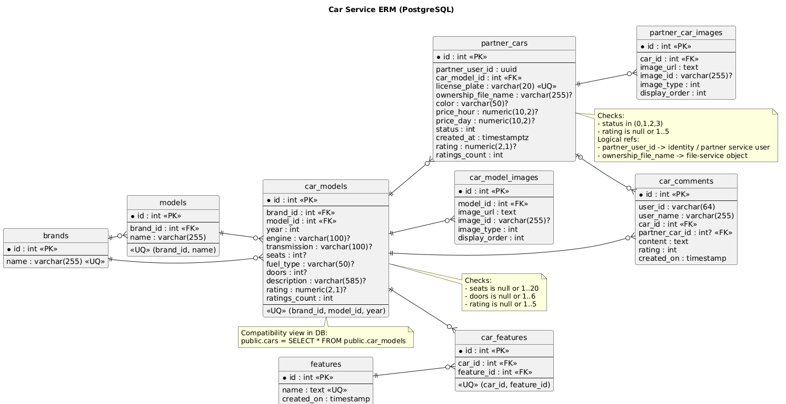

# Car Service

## Назначение
Сервис каталога и партнерских машин для каршеринга. Отвечает за:
- CRUD моделей автомобилей (`car_models`) с нормализованным каталогом `brands` + `models`;
- CRUD партнерских машин (`partner_cars`);
- CRUD комментариев к партнерским машинам;
- CRUD изображений моделей и партнерских машин через `image-service`;
- партнерский кабинет `/my` (сводка, детали, отзывы, связанные бронирования);
- автоподбор машины по модели и временному интервалу;
- внутренний provisioning партнерской машины (после approve `PartnerCar` тикета).

## Структура каталога
- `brands` - справочник марок (`Toyota`, `Nissan`, ...).
- `models` - справочник моделей (`Camry`, `Skyline`, ...) c ссылкой на `brands`.
- `car_models` - основная сущность каталога, содержит тех. характеристики/год и ссылки на `brands` + `models`.

### ERM Диаграмма


## Стек
- ASP.NET Core (`net10.0`)
- PostgreSQL
- Flyway (SQL миграции)
- JWT авторизация
- HTTP-интеграции с `partner-service`, `booking-service`, `image-service`

## API
Нативный base path сервиса: `/`.
Через gateway сервис обычно доступен по префиксу `/cars`.

### Модели автомобилей (`/models`)
- `GET /models` (`AllowAnonymous`, query: `brand`, `model`, `year`, `page`, `pageSize`)
- `GET /models/{id:int}` (`AllowAnonymous`)
- `POST /models` (policy `car-models:create`)
- `PUT /models/{id:int}` (policy `car-models:update`)
- `DELETE /models/{id:int}` (policy `car-models:delete`)

### Партнерские машины (`/partner-cars`)
- `GET /partner-cars` (`AllowAnonymous`, query: `carModelId`, `status`, `partnerUserId`, `page`, `pageSize`)
- `GET /partner-cars/{id:int}` (`AllowAnonymous`)
- `POST /partner-cars` (policy `partner-cars:create`)
- `PUT /partner-cars/{id:int}` (policy `partner-cars:update`)
- `DELETE /partner-cars/{id:int}` (policy `partner-cars:delete`)

Статусы `partner-cars`:
- `0` `Available`
- `1` `Reserved`
- `2` `InTrip`
- `3` `Maintenance`

### Комментарии (`/comments`)
- `GET /comments/partner-cars/{partnerCarId:int}` (`AllowAnonymous`, query: `page`, `pageSize`)
- `GET /comments/{id:int}` (`AllowAnonymous`)
- `POST /comments` (policy `car-comments:create`)
- `PUT /comments/{id:int}` (policy `car-comments:update`)
- `DELETE /comments/{id:int}` (policy `car-comments:delete`)

### Изображения (`/images`)
Модельные изображения:
- `POST /images/models/{modelId:int}` (policy `car-models:update`)
- `GET /images/models/{modelId:int}` (`AllowAnonymous`)
- `PUT /images/models/{imageId:int}` (policy `car-models:update`)
- `DELETE /images/models/{imageId:int}` (policy `car-models:delete`)

Изображения партнерских машин:
- `POST /images/partner-cars/{partnerCarId:int}` (policy `car-images:create`)
- `GET /images/partner-cars/{partnerCarId:int}` (`AllowAnonymous`)
- `PUT /images/partner-cars/{imageId:int}` (policy `car-images:update`)
- `DELETE /images/partner-cars/{imageId:int}` (policy `car-images:delete`)

### Личный кабинет партнера (`/my`)
- `GET /my` (policy `partner-cars:view-own`)
- `GET /my/{id:int}` (policy `partner-cars:view-own`)

Для `/my` дополнительно выполняется проверка текущего пользователя через `partner-service`.

### Автоподбор и доступные модели
- `GET /available-models` (`AllowAnonymous`)
  - список моделей, по которым есть машины в статусе `Available`
  - содержит `availableCarsCount`, ценовой диапазон и средний рейтинг
- `POST /match` (`AllowAnonymous`)
  - подбирает лучшую машину партнера по `modelId + startTime + endTime`
  - сначала берутся кандидаты `status=Available`
  - затем через `booking-service` исключаются занятые машины
  - ранжирование выполняется по:
    - загрузке партнера;
    - среднему рейтингу;
    - количеству бронирований машины;
    - цене (`priceHour`)
  - если доступной машины нет, возвращаются `suggestedStartTimesUtc`

### Internal API (`/internal/partner-cars`)
Требуется заголовок `X-Internal-Api-Key`.

- `POST /internal/partner-cars/provision`
  - используется `ticket-service` после approve тикета типа `PartnerCar`
  - создает `partner_car` + изображения + ownership-файл
  - если пары `brand+model` нет в каталоге:
    - автоматически создаются `brand`, `model` и новая запись в `car_models`
    - фото машины из тикета сохраняются как `car_model_images` для новой модели

## Примеры payload
### Создание модели (`POST /models`)

```json
{
  "brand": "Toyota",
  "model": "Camry",
  "year": 2024,
  "engine": "2.5L",
  "transmission": "Automatic",
  "seats": 5,
  "fuelType": "Petrol",
  "doors": 4,
  "description": "Mid-size sedan"
}
```

### Создание партнерской машины (`POST /partner-cars`)

```json
{
  "carModelId": 10,
  "licensePlate": "123ABC02",
  "color": "White",
  "priceHour": 3500,
  "priceDay": 24000,
  "status": "Available"
}
```

### Создание комментария (`POST /comments`)

```json
{
  "partnerCarId": 25,
  "content": "Машина в хорошем состоянии",
  "rating": 5
}
```

### Автоподбор (`POST /match`)

Запрос:

```json
{
  "modelId": 12,
  "startTime": "2026-03-10T10:00:00Z",
  "endTime": "2026-03-10T14:00:00Z"
}
```

Успешный подбор:

```json
{
  "isAvailable": true,
  "partnerCarId": 101,
  "partnerUserId": "2c51e4d3-250d-4f6b-9f4c-1c8c7e62e35a",
  "priceHour": 3500,
  "modelBrand": "Toyota",
  "modelName": "Camry",
  "modelYear": 2024,
  "suggestedStartTimesUtc": []
}
```

Нет доступной машины:

```json
{
  "isAvailable": false,
  "partnerCarId": null,
  "partnerUserId": null,
  "suggestedStartTimesUtc": [
    "2026-03-11T08:00:00Z",
    "2026-03-11T12:00:00Z"
  ]
}
```

### Создание изображения (`POST /images/partner-cars/{partnerCarId}`)

```json
{
  "base64Content": "iVBORw0KGgoAAAANSUhEUgAA...",
  "imageType": "Front",
  "displayOrder": 1
}
```

## Интеграции
Сервис использует:
- `partner-service` для проверки, что текущий пользователь действительно партнер;
- `booking-service` для:
  - связанных бронирований и агрегатов по машинам в `/my`;
  - проверки доступности кандидатов в `/match` (`/internal/bookings/check-availability`);
- `image-service` для хранения бинарных изображений (upload/delete/update).

## Переменные окружения
См. `./.env.example`:
- `Jwt__PublicKey`
- `Cors__AllowedOrigins__0`
- `PartnerService__BaseUrl`
- `BookingService__BaseUrl`
- `BookingService__InternalApiKey`
- `ImageService__BaseUrl`
- `InternalAuth__ApiKey`
- `EXTERNAL_PORT`
- `POSTGRES_USER`
- `POSTGRES_PASSWORD`
- `POSTGRES_DB`
- `POSTGRES_PORT`

## Запуск
### В составе всего проекта (рекомендуется)
Из корня репозитория:

```bash
docker compose up --build car-db car-flyway car-service
```

### Автономно
Из `backend/external/car-service`:

```bash
cp .env.example .env
docker compose -f docker-compose.yaml up --build
```

Сервис доступен на порту `EXTERNAL_PORT` (по умолчанию `1298`).

## Необходимые права
Права проверяются по claim `permissions` в JWT.

- `CarModel.Create` -> `POST /models`
- `CarModel.Update` -> `PUT /models/{id}`, `POST|PUT /images/models/...`
- `CarModel.Delete` -> `DELETE /models/{id}`, `DELETE /images/models/...`
- `PartnerCar.Create` -> `POST /partner-cars`
- `PartnerCar.Update` -> `PUT /partner-cars/{id}`
- `PartnerCar.Delete` -> `DELETE /partner-cars/{id}`
- `PartnerCar.ViewOwn` -> `GET /my`, `GET /my/{id}`
- `CarComment.Create` -> `POST /comments`
- `CarComment.Update` -> `PUT /comments/{id}`
- `CarComment.Delete` -> `DELETE /comments/{id}`
- `CarImage.Create` -> `POST /images/partner-cars/...`
- `CarImage.Update` -> `PUT /images/partner-cars/...`
- `CarImage.Delete` -> `DELETE /images/partner-cars/...`

Маршруты без permission-проверок:
- `GET /models`, `GET /models/{id}`
- `GET /partner-cars`, `GET /partner-cars/{id}`
- `GET /available-models`
- `POST /match`
