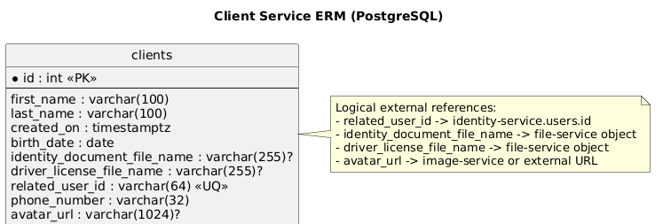

# Client Service

## Назначение
Сервис клиентов. Отвечает за хранение профиля клиента и CRUD-операции:
- имя и фамилия;
- дата создания;
- дата рождения;
- имя файла удостоверения личности (из file-service);
- имя файла водительских прав (из file-service);
- связанный `relatedUserId` (id пользователя из identity-service);
- номер телефона;
- ссылка на аватар (из image-service).

### ERM Диаграмма



## Стек
- ASP.NET Core (`net10.0`)
- PostgreSQL
- Flyway (миграции)
- JWT авторизация

## API
Нативный base path сервиса: `/`.
Через gateway сервис доступен по префиксу `/clients`.

Маршруты:
- `GET /` (policy `clients:view`)
- `GET /{id:int}` (policy `clients:view`)
- `POST /` (policy `clients:create`)
- `PUT /{id:int}` (policy `clients:update`)
- `DELETE /{id:int}` (policy `clients:delete`)
- `GET /me` (требует валидный JWT, без отдельной policy)
- `POST /internal/clients/provision` (внутренний endpoint, header `X-Internal-Api-Key`)

Пример создания клиента:

```json
{
  "firstName": "Arlan",
  "lastName": "Nurlybek",
  "birthDate": "1998-06-12",
  "identityDocumentFileName": "id_arl_001.pdf",
  "driverLicenseFileName": "license_arl_001.pdf",
  "relatedUserId": "9a34d821-bf4f-4de1-a607-4f1386f8f0f4",
  "phoneNumber": "+77011234567",
  "avatarUrl": "https://storage.example.com/avatars/arlan.png"
}
```

## Переменные окружения
См. `./.env.example`:
- `Jwt__PublicKey`
- `Cors__AllowedOrigins__0`
- `InternalAuth__ApiKey`
- `EXTERNAL_PORT`
- `POSTGRES_USER`
- `POSTGRES_PASSWORD`
- `POSTGRES_DB`
- `POSTGRES_PORT`

## Запуск
### В составе всего проекта (рекомендуется)
Из корня репозитория:

```bash
docker compose up --build client-db client-flyway client-service
```

### Автономно
Из `backend/external/client-service`:

```bash
cp .env.example .env
docker compose -f docker-compose.yaml up --build
```

Сервис будет доступен на порту `EXTERNAL_PORT` (по умолчанию `1831`).

## Необходимые права
Права проверяются по claim `permissions` в JWT.

Требуются permissions:
- `Client.View` - просмотр клиентов (`GET /`, `GET /{id}`)
- `Client.Create` - создание клиента (`POST /`)
- `Client.Update` - обновление клиента (`PUT /{id}`)
- `Client.Delete` - удаление клиента (`DELETE /{id}`)

Маршрут `GET /me` требует только валидный JWT и возвращает детали пользователя из токена.

Внутренний маршрут `POST /internal/clients/provision` не требует JWT, но требует валидный `X-Internal-Api-Key`.

