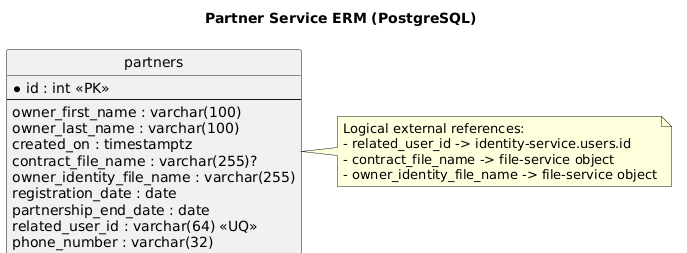

# Partner Service

## Назначение
Сервис партнеров. Отвечает за хранение профиля партнера и CRUD-операции:
- имя владельца;
- фамилия владельца;
- дата создания записи;
- имя файла контракта (из file-service);
- имя файла удостоверения владельца (из file-service);
- дата регистрации;
- дата окончания партнерства;
- связанный `relatedUserId` (id пользователя из identity-service);
- номер телефона.

### ERM Диаграмма


## Стек
- ASP.NET Core (`net10.0`)
- PostgreSQL
- Flyway (миграции)
- JWT авторизация

## API
Нативный base path сервиса: `/`.
Через gateway сервис доступен по префиксу `/partners`.

Маршруты:
- `GET /` (policy `partners:view`)
- `GET /{id:int}` (policy `partners:view`)
- `POST /` (policy `partners:create`)
- `PUT /{id:int}` (policy `partners:update`)
- `DELETE /{id:int}` (policy `partners:delete`)
- `GET /me` (требует валидный JWT, без отдельной policy)
- `GET /public/by-related-user/{relatedUserId}` (`AllowAnonymous`, публичный профиль перевозчика: имя + relatedUserId)
- `POST /internal/partners/provision` (внутренний endpoint, header `X-Internal-Api-Key`)

Пример создания партнера:

```json
{
  "ownerFirstName": "Arlan",
  "ownerLastName": "Nurlybek",
  "contractFileName": "contract_arl_001.pdf",
  "ownerIdentityFileName": "owner_id_arl_001.pdf",
  "registrationDate": "2025-01-10",
  "partnershipEndDate": "2026-01-10",
  "relatedUserId": "9a34d821-bf4f-4de1-a607-4f1386f8f0f4",
  "phoneNumber": "+77011234567"
}
```

## Переменные окружения
См. `./.env.example`:
- `Jwt__PublicKey`
- `Cors__AllowedOrigins__0`
- `InternalAuth__ApiKey`
- `EXTERNAL_PORT`
- `POSTGRES_USER`
- `POSTGRES_PASSWORD`
- `POSTGRES_DB`
- `POSTGRES_PORT`

## Запуск
### В составе всего проекта (рекомендуется)
Из корня репозитория:

```bash
docker compose up --build partner-db partner-flyway partner-service
```

### Автономно
Из `backend/internal/partner-service`:

```bash
cp .env.example .env
docker compose -f docker-compose.yaml up --build
```

Сервис будет доступен на порту `EXTERNAL_PORT` (по умолчанию `1832`).

## Необходимые права
Права проверяются по claim `permissions` в JWT.

Требуются permissions:
- `Partner.View` - просмотр партнеров (`GET /`, `GET /{id}`)
- `Partner.Create` - создание партнера (`POST /`)
- `Partner.Update` - обновление партнера (`PUT /{id}`)
- `Partner.Delete` - удаление партнера (`DELETE /{id}`)

Маршрут `GET /me` требует валидный JWT и возвращает карточку партнера, связанную с `relatedUserId` текущего пользователя.
Этот маршрут нужен для загрузки partner-данных, а не для определения actor type пользователя: доменной классификацией теперь служит claim `actor_type` в JWT.

Внутренний маршрут `POST /internal/partners/provision` не требует JWT, но требует валидный `X-Internal-Api-Key`.
