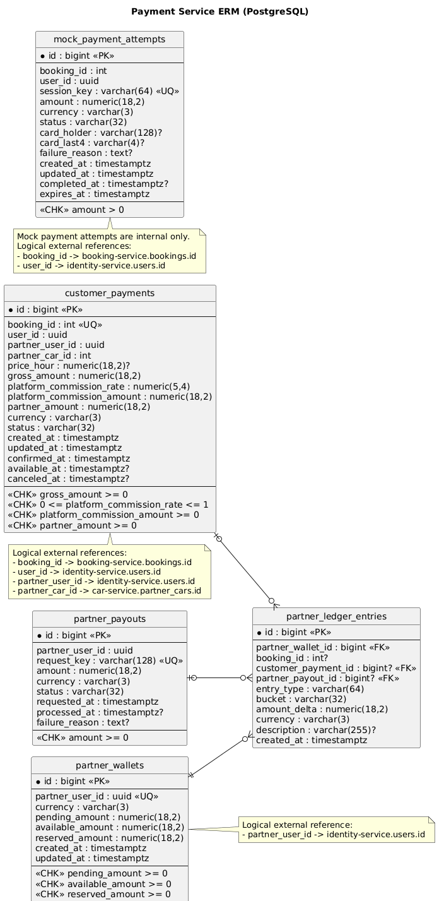

# Payment Service

## Назначение
Внутренний сервис финансового учета партнера. Отвечает за:
- кошелек партнера (`partner_wallets`);
- бухгалтерский журнал движений (`partner_ledger_entries`);
- клиентские оплаты по бронированиям (`customer_payments`);
- выплаты партнеру (`partner_payouts`).

Сейчас сервис используется `booking-service` для синхронизации статусов бронирования:
- `Confirmed` -> деньги партнера попадают в `pending`;
- `Canceled` -> pending-зачисление сторнируется;
- `Completed` -> сумма переводится из `pending` в `available`.

## API
Нативный base path сервиса: `/`.
Сервис пока предназначен для внутренних вызовов и использует `X-Internal-Api-Key`.

Маршруты:
- `POST /internal/payments/bookings/confirm`
- `POST /internal/payments/bookings/cancel`
- `POST /internal/payments/bookings/complete`
- `GET /internal/payments/wallets/{partnerUserId}`
- `GET /internal/payments/ledger/{partnerUserId}?take=50`

## ERM Диаграмма

