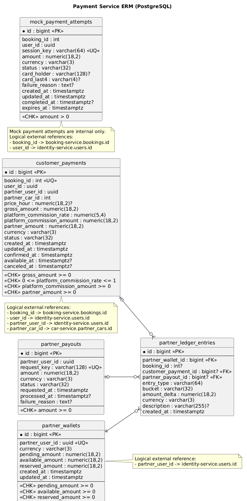

# Payment Service

## Назначение
Внутренний сервис финансового учета партнера. Отвечает за:
- кошелек партнера (`partner_wallets`);
- бухгалтерский журнал движений (`partner_ledger_entries`);
- клиентские оплаты по бронированиям (`customer_payments`);
- выплаты партнеру (`partner_payouts`).

Сейчас сервис используется `booking-service` для синхронизации статусов бронирования:
- `Confirmed` -> деньги партнера попадают в `pending`;
- `Canceled` -> pending-зачисление сторнируется;
- `Completed` -> сумма переводится из `pending` в `available`.
- damage/fine charge -> создается начисление, которое может быть оплачено или списано.

## API
Нативный base path сервиса: `/`.

### Internal API
Внутренние маршруты используют `X-Internal-Api-Key`.

- `POST /internal/payments/bookings/confirm`
- `POST /internal/payments/bookings/cancel`
- `POST /internal/payments/bookings/complete`
- `POST /internal/mock-payments/start`
- `GET /internal/mock-payments/by-booking/{bookingId}`
- `POST /internal/mock-payments/{bookingId}/submit`
- `POST /internal/payments/booking-charges`
- `POST /internal/payments/booking-charges/{chargeId}/paid`
- `POST /internal/payments/booking-charges/{chargeId}/cancel`
- `POST /internal/payments/booking-charges/{chargeId}/refund`
- `GET /internal/payments/bookings/{bookingId}/charges`
- `GET /internal/payments/users/{userId}/booking-charges`
- `GET /internal/payments/wallets/{partnerUserId}`
- `GET /internal/payments/ledger/{partnerUserId}?take=50`
- `POST /internal/payments/payouts/request`
- `POST /internal/payments/payouts/{payoutId}/processing|paid|failed|cancel`
- `GET /internal/payments/payouts/{payoutId}`
- `GET /internal/payments/payouts/by-partner/{partnerUserId}`

### View API
Read-only маршруты доступны через gateway как `/payments/view/*` и требуют JWT permission `Payment.View`.

- `GET /view/bookings/{bookingId}/charges`

Во frontend это используется как:

```text
GET /payments/view/bookings/{bookingId}/charges
```

## ERM Диаграмма

