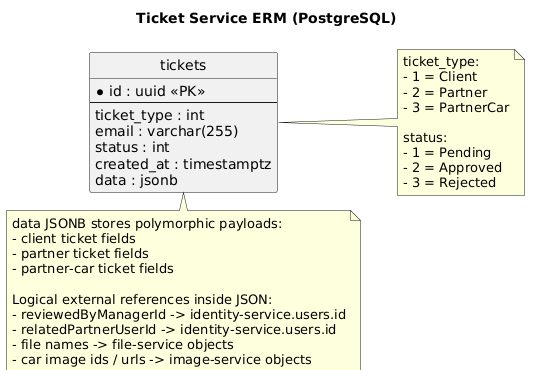

# Ticket Service

## Назначение
Сервис тикетов регистрации/верификации и оркестрации одобрения. Поддерживает типы:
- `Client` - регистрация клиента;
- `Partner` - регистрация партнера;
- `PartnerCar` - добавление машины партнером через согласование.

Основные задачи:
- создание тикета;
- просмотр pending-очереди менеджером;
- approve/reject с фиксированием причины/менеджера/времени;
- интеграции с другими сервисами при approve/reject;
- выдача временных ссылок на документы тикета.

### ERM Диаграмма



## Стек
- ASP.NET Core (`net10.0`)
- PostgreSQL
- Flyway (миграции через корневой `docker-compose.yml`)
- JWT авторизация

## API
Нативный base path сервиса: `/`.
Через gateway сервис доступен по префиксу `/tickets`.

Маршруты:
- `POST /` (`AllowAnonymous`) - создание тикета (`multipart/form-data`)
- `GET /pending` (policy `tickets:view`)
- `GET /{id:guid}` (policy `tickets:view`)
- `GET /{id:guid}/documents/{documentType}/temporary-link` (policy `tickets:view`)
  - `documentType`: `identity` | `license` | `ownership`
- `POST /{id:guid}/approve` (policy `tickets:approve`)
- `POST /{id:guid}/reject` (policy `tickets:reject`)
- `GET /healthz`
- `GET /metrics`

## Контракты
### Создание тикета (`POST /`)
Тип контента: `multipart/form-data`.

Общие поля:
- `ticketType` (`Client` | `Partner` | `PartnerCar`, optional, default `Client`)
- `email` (обязателен)

Для `Client`:
- `firstName`, `lastName`, `phoneNumber`, `birthDate` (обязательны)
- `identityDocumentFile` (PDF, обязателен)
- `driverLicenseFile` (PDF, обязателен)
- `avatarUrl` (optional)

Для `Partner`:
- `firstName`, `lastName`, `phoneNumber` (обязательны)
- `identityDocumentFile` (PDF, обязателен)
- `companyName`, `contactEmail` (optional)

Для `PartnerCar`:
- `carBrand`, `carModel`, `licensePlate` (обязательны)
- `ownershipDocumentFile` (PDF, обязателен)
- `carImageFiles[]` (минимум 1 изображение)
- `email` (обязателен, используется для уведомлений)

Важно:
- endpoint помечен как `AllowAnonymous`, но для `PartnerCar` требуется `Authorization` header:
  - сервис извлекает текущего партнера из `partner-service /me`;
  - имя/фамилия/телефон владельца подтягиваются автоматически.

### Approve (`POST /{id}/approve`)
Body необязателен.

Для `PartnerCar` менеджер может передать правки перед approve:

```json
{
  "partnerCarData": {
    "carBrand": "Toyota",
    "carModel": "Camry",
    "licensePlate": "123ABC02",
    "email": "partner@example.com"
  }
}
```

### Reject (`POST /{id}/reject`)

```json
{
  "decisionReason": "Некорректные данные",
  "partnerCarData": {
    "carBrand": "Toyota",
    "carModel": "Camry",
    "licensePlate": "123ABC02",
    "email": "partner@example.com"
  }
}
```

`partnerCarData` optional и используется для фиксации отредактированных менеджером значений.

## Интеграции
При обработке тикетов сервис вызывает:

- `identity-service`
  - `POST /internal/users/provision` (`X-Internal-Api-Key`)
- `client-service`
  - `POST /internal/clients/provision` (`X-Internal-Api-Key`)
- `partner-service`
  - `POST /internal/partners/provision` (`X-Internal-Api-Key`)
  - `GET /me` (с `Authorization`) для `PartnerCar` create
- `file-service`
  - `POST /api/internal/files/upload` (`X-Internal-Api-Key`)
  - `POST /api/internal/files/temporary-link` (`X-Internal-Api-Key`)
- `image-service`
  - `POST /api/images` (с `Authorization`) для загрузки фото `PartnerCar`
- `car-service`
  - `POST /internal/partner-cars/provision` (`X-Internal-Api-Key`) после approve `PartnerCar`
- `email-service`
  - `POST /emails/approved`
  - `POST /emails/rejected`
  - `POST /emails/partners/approved`
  - `POST /emails/partners/rejected`
  - `POST /emails/partners/cars/approved`
  - `POST /emails/partners/cars/rejected`

## Переменные окружения
См. `./.env.example`:
- `Jwt__PublicKey`
- `Cors__AllowedOrigins__0`
- `IdentityService__BaseUrl`
- `IdentityService__InternalApiKey`
- `EmailService__BaseUrl`
- `ClientService__BaseUrl`
- `ClientService__InternalApiKey`
- `PartnerService__BaseUrl`
- `PartnerService__InternalApiKey`
- `FileService__BaseUrl`
- `FileService__InternalApiKey`
- `ImageService__BaseUrl`
- `CarService__BaseUrl`
- `CarService__InternalApiKey`
- `Activation__SetPasswordBaseUrl`
- `EXTERNAL_PORT`
- `POSTGRES_USER`
- `POSTGRES_PASSWORD`
- `POSTGRES_DB`
- `POSTGRES_PORT`

## Наблюдаемость
- сервис принимает и возвращает `X-Request-Id`;
- принимает и продолжает `traceparent`;
- пишет JSON-логи с `requestId`/`traceId` для входящих запросов и исходящих S2S вызовов;
- публикует `Prometheus`-совместимые метрики на `GET /metrics`;
- экспортирует входящие HTTP spans и исходящие `HttpClient` spans в `OpenTelemetry Collector` и дальше в `Tempo`, если задан `OTEL_EXPORTER_OTLP_ENDPOINT`.

## Запуск
В папке сервиса отдельного `docker-compose` нет. Рекомендуемый запуск - из корня репозитория:

```bash
docker compose up --build ticket-db ticket-flyway ticket-service
```

Сервис доступен на порту `TICKET_SERVICE_PORT` (по умолчанию `1248`).

## Необходимые права
Права проверяются по claim `permissions` в JWT.

- `Ticket.View` - `GET /pending`, `GET /{id}`, `GET /{id}/documents/...`
- `Ticket.Approve` - `POST /{id}/approve`
- `Ticket.Reject` - `POST /{id}/reject`

Публичный маршрут без JWT:
- `POST /` (для `Client` и `Partner`)

Для `PartnerCar` create требуется валидный `Authorization` header текущего партнера.
