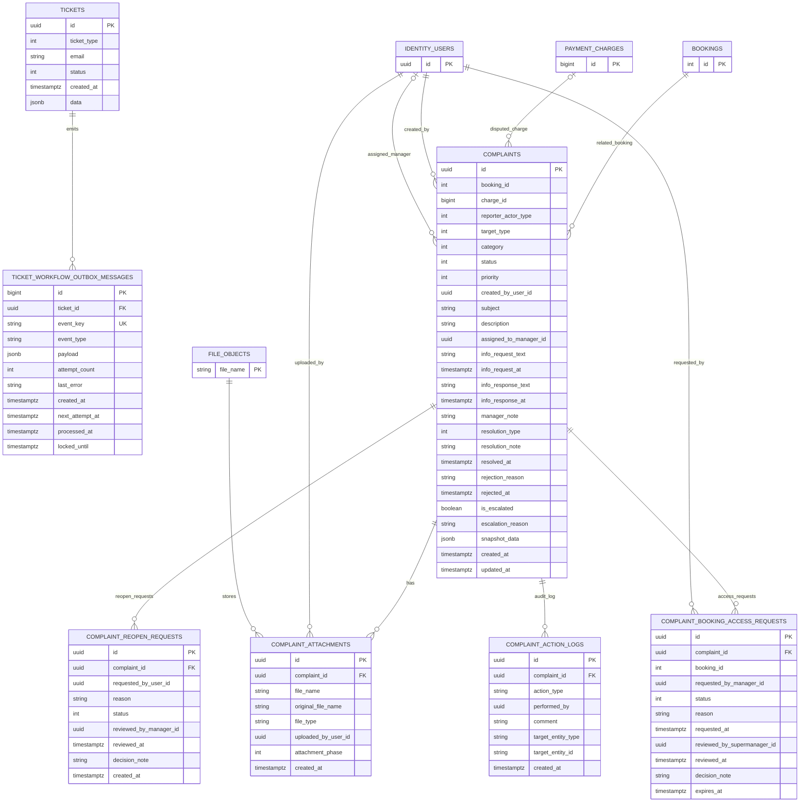

# Ticket Service

## Назначение
Сервис тикетов регистрации/верификации, жалоб и менеджерских review-потоков. Поддерживает типы:
- `Client` - регистрация клиента;
- `Partner` - регистрация партнера;
- `PartnerCar` - добавление машины партнером через согласование;
- booking completion review и partner cancellation review через ticket workflow;
- complaints и booking access requests.

Основные задачи:
- создание тикета;
- просмотр pending-очереди менеджером;
- approve/reject с фиксированием причины/менеджера/времени;
- интеграции с другими сервисами при approve/reject;
- выдача временных ссылок на документы тикета;
- очередь жалоб, action logs, reopen requests и доступ к booking review;
- создание/миграция chat conversations для complaint context.

### ERM Диаграмма


```mermaid
erDiagram
  TICKETS {
    uuid id PK
    int ticket_type
    string email
    int status
    timestamptz created_at
    jsonb data
  }

  TICKET_WORKFLOW_OUTBOX_MESSAGES {
    bigint id PK
    uuid ticket_id FK
    string event_key UK
    string event_type
    jsonb payload
    int attempt_count
    string last_error
    timestamptz created_at
    timestamptz next_attempt_at
    timestamptz processed_at
    timestamptz locked_until
  }

  COMPLAINTS {
    uuid id PK
    int booking_id
    bigint charge_id
    int reporter_actor_type
    int target_type
    int category
    int status
    int priority
    uuid created_by_user_id
    string subject
    string description
    uuid assigned_to_manager_id
    string info_request_text
    timestamptz info_request_at
    string info_response_text
    timestamptz info_response_at
    string manager_note
    int resolution_type
    string resolution_note
    timestamptz resolved_at
    string rejection_reason
    timestamptz rejected_at
    boolean is_escalated
    string escalation_reason
    jsonb snapshot_data
    timestamptz created_at
    timestamptz updated_at
  }

  COMPLAINT_ATTACHMENTS {
    uuid id PK
    uuid complaint_id FK
    string file_name
    string original_file_name
    string file_type
    uuid uploaded_by_user_id
    int attachment_phase
    timestamptz created_at
  }

  COMPLAINT_BOOKING_ACCESS_REQUESTS {
    uuid id PK
    uuid complaint_id FK
    int booking_id
    uuid requested_by_manager_id
    int status
    string reason
    timestamptz requested_at
    uuid reviewed_by_supermanager_id
    timestamptz reviewed_at
    string decision_note
    timestamptz expires_at
  }

  COMPLAINT_REOPEN_REQUESTS {
    uuid id PK
    uuid complaint_id FK
    uuid requested_by_user_id
    string reason
    int status
    uuid reviewed_by_manager_id
    timestamptz reviewed_at
    string decision_note
    timestamptz created_at
  }

  COMPLAINT_ACTION_LOGS {
    uuid id PK
    uuid complaint_id FK
    string action_type
    uuid performed_by
    string comment
    string target_entity_type
    string target_entity_id
    timestamptz created_at
  }

  BOOKINGS {
    int id PK
  }

  PAYMENT_CHARGES {
    bigint id PK
  }

  IDENTITY_USERS {
    uuid id PK
  }

  FILE_OBJECTS {
    string file_name PK
  }

  TICKETS ||--o{ TICKET_WORKFLOW_OUTBOX_MESSAGES : emits
  COMPLAINTS ||--o{ COMPLAINT_ATTACHMENTS : has
  COMPLAINTS ||--o{ COMPLAINT_BOOKING_ACCESS_REQUESTS : access_requests
  COMPLAINTS ||--o{ COMPLAINT_REOPEN_REQUESTS : reopen_requests
  COMPLAINTS ||--o{ COMPLAINT_ACTION_LOGS : audit_log
  BOOKINGS ||--o{ COMPLAINTS : related_booking
  PAYMENT_CHARGES |o--o{ COMPLAINTS : disputed_charge
  IDENTITY_USERS ||--o{ COMPLAINTS : created_by
  IDENTITY_USERS |o--o{ COMPLAINTS : assigned_manager
  IDENTITY_USERS ||--o{ COMPLAINT_ATTACHMENTS : uploaded_by
  IDENTITY_USERS ||--o{ COMPLAINT_BOOKING_ACCESS_REQUESTS : requested_by
  FILE_OBJECTS ||--o{ COMPLAINT_ATTACHMENTS : stores
```


## Стек
- ASP.NET Core (`net10.0`)
- PostgreSQL
- Flyway (миграции через корневой `docker-compose.yml`)
- JWT авторизация
- RabbitMQ outbox для workflow events

## API
Нативный base path сервиса: `/`.
Через gateway сервис доступен по префиксу `/tickets`.

Маршруты:
- `POST /` (`AllowAnonymous`) - создание тикета (`multipart/form-data`)
- `GET /all` (policy `tickets:view-all`)
- `GET /pending` (policy `tickets:view`)
- `GET /{id:guid}` (policy `tickets:view`)
- `GET /{id:guid}/documents/{documentType}/temporary-link` (policy `tickets:view`)
  - `documentType`: `identity` | `license` | `ownership`
- `POST /{id:guid}/approve` (policy `tickets:approve`)
- `POST /{id:guid}/reject` (policy `tickets:reject`)
- `POST /{id:guid}/issue-fine` (booking completion fine workflow)
- `GET /healthz`
- `GET /metrics`

### Complaints (`/complaints`)
- `POST /complaints` - создать жалобу (`multipart/form-data`)
- `GET /complaints/my`
- `GET /complaints/my/{id:guid}`
- `POST /complaints/my/{id:guid}/respond`
- `GET /complaints/my/by-booking/{bookingId:int}`
- `POST /complaints/my/{id:guid}/reopen-request`
- `GET /complaints/my/{id:guid}/reopen-requests`
- `GET /complaints/all` (manager queue)
- `GET /complaints/all/{id:guid}`
- `POST /complaints/all/{id:guid}/take`
- `POST /complaints/all/{id:guid}/request-info`
- `POST /complaints/all/{id:guid}/note`
- `POST /complaints/all/{id:guid}/resolve`
- `POST /complaints/all/{id:guid}/reject`
- `POST /complaints/all/{id:guid}/actions/cancel-booking`
- `POST /complaints/all/{id:guid}/actions/waive-charge`
- `POST /complaints/all/{id:guid}/actions/escalate`
- `POST /complaints/all/{id:guid}/actions/refund-charge`
- `GET /complaints/all/{id:guid}/action-logs`

### Booking access requests
- `POST /complaints/{complaintId:guid}/booking-access-requests`
- `GET /complaints/{complaintId:guid}/booking-access-requests/mine`
- `GET /complaints/{complaintId:guid}/booking-review`
- `GET /complaints/access-requests`
- `GET /complaints/access-requests/{id:guid}`
- `POST /complaints/access-requests/{id:guid}/approve`
- `POST /complaints/access-requests/{id:guid}/reject`
- `POST /complaints/access-requests/{id:guid}/revoke`

## Контракты
### Создание тикета (`POST /`)
Тип контента: `multipart/form-data`.

Общие поля:
- `ticketType` (`Client` | `Partner` | `PartnerCar`, optional, default `Client`)
- `email` (обязателен)

Для `Client`:
- `firstName`, `lastName`, `phoneNumber`, `birthDate` (обязательны)
- `identityDocumentFile` (PDF, обязателен)
- `driverLicenseFile` (PDF, обязателен)
- `avatarUrl` (optional)

Для `Partner`:
- `firstName`, `lastName`, `phoneNumber` (обязательны)
- `identityDocumentFile` (PDF, обязателен)
- `companyName`, `contactEmail` (optional)

Для `PartnerCar`:
- `carBrand`, `carModel`, `licensePlate` (обязательны)
- `ownershipDocumentFile` (PDF, обязателен)
- `carImageFiles[]` (минимум 1 изображение)
- `transmission`, `fuelType`, `seats`, `doors`, `bodyType`, `horsepower` (optional structured fields)
- `selectedTags[]` (optional preset semantic tags)

Важно:
- endpoint помечен как `AllowAnonymous`, но для `PartnerCar` требуется `Authorization` header:
  - сервис извлекает текущего партнера из `partner-service /me`;
  - email для уведомлений берется из authenticated user claims;
  - имя/фамилия/телефон владельца подтягиваются автоматически.

### Approve (`POST /{id}/approve`)
Body необязателен.

Для `PartnerCar` менеджер может передать правки перед approve:

```json
{
  "partnerCarData": {
    "carBrand": "Toyota",
    "carModel": "Camry",
    "licensePlate": "123ABC02",
    "fuelType": "petrol",
    "bodyType": "sedan",
    "horsepower": 181,
    "confirmedTags": ["business", "comfort"]
  }
}
```

### Reject (`POST /{id}/reject`)

```json
{
  "decisionReason": "Некорректные данные",
  "partnerCarData": {
    "carBrand": "Toyota",
    "carModel": "Camry",
    "licensePlate": "123ABC02",
    "confirmedTags": ["business", "comfort"]
  }
}
```

`partnerCarData` optional и используется для фиксации отредактированных менеджером значений.

## Интеграции
При обработке тикетов сервис вызывает:

- `identity-service`
  - `POST /internal/users/provision` (`X-Internal-Api-Key`)
- `client-service`
  - `POST /internal/clients/provision` (`X-Internal-Api-Key`)
- `partner-service`
  - `POST /internal/partners/provision` (`X-Internal-Api-Key`)
  - `GET /me` (с `Authorization`) для `PartnerCar` create
- `file-service`
  - `POST /api/internal/files/upload` (`X-Internal-Api-Key`)
  - `POST /api/internal/files/temporary-link` (`X-Internal-Api-Key`)
- `image-service`
  - `POST /api/images` (с `Authorization`) для загрузки фото `PartnerCar`
- `car-service`
  - provisioning `PartnerCar` выполняется через RabbitMQ-событие `ticket.partner-car-provision-requested`
- `booking-service`
  - booking completion review, partner cancellation review, cancel booking action
- `payment-service`
  - refund/waive/fine flows через booking/payment workflows
- `chat-service`
  - conversations для complaints и системные сообщения
- `email-service`
  - стандартные ticket email-уведомления отправляются через RabbitMQ-события;
  - часть custom booking/complaint уведомлений может отправляться прямым HTTP-клиентом.

## Переменные окружения
См. `./.env.example`:
- `Jwt__PublicKey`
- `Cors__AllowedOrigins__0`
- `IdentityService__BaseUrl`
- `IdentityService__InternalApiKey`
- `EmailService__BaseUrl`
- `ChatService__BaseUrl`
- `ChatService__InternalApiKey`
- `BookingService__BaseUrl`
- `BookingService__InternalApiKey`
- `ClientService__BaseUrl`
- `ClientService__InternalApiKey`
- `PartnerService__BaseUrl`
- `PartnerService__InternalApiKey`
- `FileService__BaseUrl`
- `FileService__InternalApiKey`
- `ImageService__BaseUrl`
- `CarService__BaseUrl`
- `CarService__InternalApiKey`
- `RabbitMq__HostName`
- `RabbitMq__Port`
- `RabbitMq__UserName`
- `RabbitMq__Password`
- `RabbitMq__ExchangeName`
- `Activation__SetPasswordBaseUrl`
- `EXTERNAL_PORT`
- `POSTGRES_USER`
- `POSTGRES_PASSWORD`
- `POSTGRES_DB`
- `POSTGRES_PORT`

## Наблюдаемость
- сервис принимает и возвращает `X-Request-Id`;
- принимает и продолжает `traceparent`;
- пишет JSON-логи с `requestId`/`traceId` для входящих запросов и исходящих S2S вызовов;
- публикует `Prometheus`-совместимые метрики на `GET /metrics`;
- экспортирует входящие HTTP spans и исходящие `HttpClient` spans в `OpenTelemetry Collector` и дальше в `Tempo`, если задан `OTEL_EXPORTER_OTLP_ENDPOINT`.

## Запуск
В папке сервиса отдельного `docker-compose` нет. Рекомендуемый запуск - из корня репозитория:

```bash
docker compose up --build ticket-db ticket-flyway ticket-service
```

Сервис доступен на порту `TICKET_SERVICE_PORT` (по умолчанию `1248`).

## Необходимые права
Права проверяются по claim `permissions` в JWT.

- `Ticket.View` - `GET /pending`, `GET /{id}`, `GET /{id}/documents/...`
- `Ticket.ViewAll` - `GET /all`, super-manager views
- `Ticket.Approve` - `POST /{id}/approve`
- `Ticket.Reject` - `POST /{id}/reject`
- `Complaint.View` - manager complaint queue
- `Complaint.Review` - complaint actions and booking review
- `AccessRequest.Review` - approve/reject/revoke booking access requests

Публичный маршрут без JWT:
- `POST /` (для `Client` и `Partner`)

Для `PartnerCar` create требуется валидный `Authorization` header текущего партнера.
