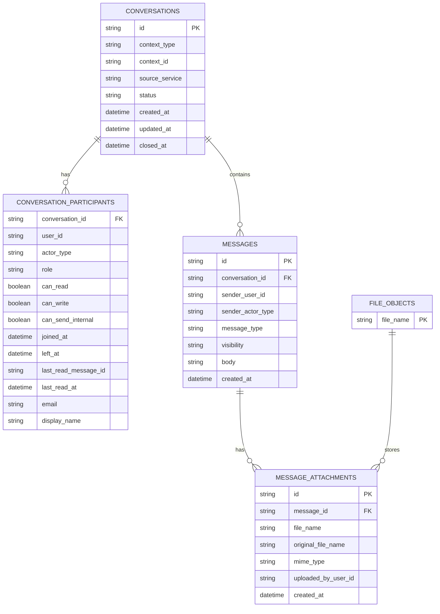

# Chat Service

## Назначение
`chat-service` хранит conversations для жалоб, booking review и других контекстных диалогов AutoRent.

Сервис отвечает за:
- conversation state и участников;
- чтение и отправку сообщений;
- realtime-доставку через SignalR;
- вложения через `file-service`;
- email-события о новых сообщениях через `RabbitMQ`.

## Runtime
В root `docker-compose.yml` сервис запускается как `chat-service`.

Зависимости:
- `chat-db` (`MongoDB`) - хранение conversations и messages;
- `file-service` - загрузка вложений и temporary links;
- `RabbitMQ` - offline/email notifications;
- `identity-service` - источник JWT, который сервис валидирует по публичному RSA-ключу.

Gateway route:

```text
/chat/* -> chat-service
```

SignalR hub доступен через:

```text
/chat/hubs/conversation
```

## Диаграмма данных



В MongoDB участники вложены в документ conversation, а attachments вложены в message. Mermaid-диаграмма показывает логическую модель для чтения контрактов и связей.

## Public API
Все public endpoints требуют валидный JWT.

| Method | Path | Назначение |
|---|---|---|
| `GET` | `/conversations/by-context/{contextType}/{contextId}` | Найти conversation по бизнес-контексту |
| `GET` | `/conversations/{conversationId}` | Получить conversation |
| `GET` | `/conversations/{conversationId}/messages?before=&limit=50` | Получить сообщения |
| `POST` | `/conversations/{conversationId}/messages` | Отправить сообщение и вложения (`multipart/form-data`) |
| `GET` | `/conversations/{conversationId}/attachments/{attachmentId}/temporary-link` | Получить temporary link на вложение |

`POST /messages` принимает:
- `body` - текст сообщения;
- `internal` - `true` для internal note;
- `files` - список вложений.

## Internal API
Internal endpoints требуют `X-Internal-Api-Key`.

| Method | Path | Назначение |
|---|---|---|
| `POST` | `/internal/conversations` | Создать conversation по контексту |
| `POST` | `/internal/conversations/{conversationId}/participants` | Добавить участника |
| `PATCH` | `/internal/conversations/{conversationId}/participants/{userId}` | Изменить права участника |
| `POST` | `/internal/conversations/{conversationId}/close` | Закрыть conversation |
| `POST` | `/internal/conversations/{conversationId}/reopen` | Переоткрыть conversation |
| `GET` | `/internal/conversations/by-context/{contextType}/{contextId}` | Найти conversation по контексту |
| `POST` | `/internal/conversations/{conversationId}/system-message` | Добавить system message |

## Сообщения и вложения
Вложения не хранятся в MongoDB как бинарные данные.

Поток:
1. `chat-service` принимает multipart request.
2. Файлы отправляются в `file-service` с `X-Internal-Api-Key`.
3. В message сохраняются metadata и file name.
4. Для просмотра frontend запрашивает temporary link через `chat-service`.

## Уведомления
После отправки сообщения сервис публикует RabbitMQ-событие о новом сообщении. `email-service` читает это событие и отправляет email участникам, которые должны получить offline notification.

## Environment
См. `.env.example`.

Ключевые переменные:
- `MongoDB__ConnectionString`
- `MongoDB__DatabaseName`
- `Jwt__PublicKey`
- `Jwt__Issuer`
- `Jwt__Audience`
- `InternalAuth__ApiKey`
- `FileService__BaseUrl`
- `FileService__InternalApiKey`
- `RabbitMq__HostName`
- `RabbitMq__Port`
- `RabbitMq__UserName`
- `RabbitMq__Password`
- `Cors__AllowedOrigins__0`

## Запуск
В составе всего проекта:

```bash
docker compose up --build chat-service
```

Локально из `backend/shared/chat-service/src`:

```bash
dotnet run --project ChatService.Api/ChatService.Api.csproj
```

Health check:

```text
GET /healthz
```
