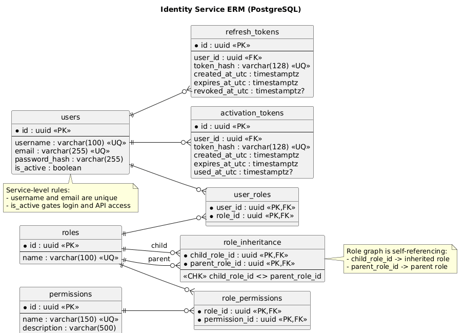

# Identity Service

## Назначение
Сервис аутентификации и авторизации AutoRent. Отвечает за:
- выдачу JWT и refresh token;
- активацию учетной записи;
- управление пользователями, ролями и permissions;
- хранение типа субъекта (`subject_type`) и доменного типа актора (`actor_type`);
- внутренний provisioning пользователя для `ticket-service`;
- публикацию JWKS (`/.well-known/jwks.json`).

### ERM Диаграмма


## Стек
- ASP.NET Core (`net10.0`)
- PostgreSQL
- Flyway (миграции)
- JWT (RSA)

## API
Нативный base path сервиса: `/`.
Через gateway сервис доступен по префиксу `/identity`.

Основные маршруты:
- `POST /auth/login`
- `POST /auth/refresh`
- `POST /auth/activate`
- `GET /.well-known/jwks.json`
- `GET /users` (policy `users:view`)
- `GET /users/{id:guid}` (policy `users:view`)
- `POST /users` (policy `users:create`)
- `PUT /users/{id:guid}` (policy `users:update`)
- `POST /users/{id:guid}/roles` (policy `users:assign-role`)
- `DELETE /users/{id:guid}/roles/{roleId:guid}` (policy `users:remove-role`)
- `PATCH /users/{id:guid}/activate` (policy `users:activate`)
- `PATCH /users/{id:guid}/deactivate` (policy `users:deactivate`)
- `DELETE /users/{id:guid}` (policy `users:delete`)
- `GET /roles` (policy `roles:view`)
- `POST /roles` (policy `roles:create`)
- `POST /roles/{id:guid}/permissions` (policy `roles:assign-permission`)
- `DELETE /roles/{id:guid}/permissions/{permissionId:guid}` (policy `roles:assign-permission`)
- `POST /roles/{id:guid}/parents` (policy `roles:assign-permission`)
- `DELETE /roles/{id:guid}/parents/{parentRoleId:guid}` (policy `roles:assign-permission`)
- `GET /permissions` (policy `permissions:view`)
- `POST /permissions` (policy `permissions:create`)
- `POST /internal/users/provision` (внутренний endpoint, header `X-Internal-Api-Key`)
- `GET /healthz`
- `GET /metrics`

Пример логина:

```json
{
  "email": "manager@autorent.kz",
  "password": "strong-password"
}
```

## Роли и inheritance
- Роль может наследовать одну или несколько parent-ролей (`role_inheritance`).
- Итоговые permissions вычисляются транзитивно по графу наследования.
- Эффективные permissions используются в:
  - выдаче JWT (`/auth/login`, `/auth/refresh`);
  - ответах `/users` и `/users/{id}`;
- ответе `/roles` (возвращаются прямые и эффективные permissions).
- Кольцевое наследование ролей запрещено.

## Subject Type и Actor Type
- `subject_type` описывает технический тип аутентифицированного субъекта: `user`, `service`, `api_key`, `system`.
- `actor_type` описывает бизнес-роль в домене: `client`, `partner`, `admin`, `internal`.
- Значения нормализованы через lookup-таблицы `subject_types` и `actor_types`.
- Пользователь в `users` хранит ссылки на lookup-записи, а не свободные строковые значения.
- Для обычных пользовательских аккаунтов по умолчанию используются `subject_type=user` и `actor_type=client`.
- RBAC-модель не меняется: роли по-прежнему нужны только для агрегации permissions, а сервисы не должны принимать решения по имени роли.

JWT, выдаваемый через `POST /auth/login` и `POST /auth/refresh`, содержит:
- `sub`
- `username`
- `subject_type`
- `actor_type`
- `permissions`

Пример payload:

```json
{
  "sub": "123",
  "username": "ivan",
  "subject_type": "user",
  "actor_type": "partner",
  "permissions": ["orders.read", "orders.write"]
}
```

## Переменные окружения
См. `./.env.example`:
- `Jwt__PrivateKey`
- `Jwt__PublicKey`
- `Cors__AllowedOrigins__0`
- `InternalAuth__ApiKey`
- `EXTERNAL_PORT`
- `POSTGRES_USER`
- `POSTGRES_PASSWORD`
- `POSTGRES_DB`
- `POSTGRES_PORT`

Дополнительно из `appsettings*.json` при необходимости:
- `Jwt__Issuer`
- `Jwt__Audience`

## Наблюдаемость
- сервис принимает и возвращает `X-Request-Id`;
- принимает и продолжает `traceparent`;
- пишет JSON-логи с `requestId`/`traceId`;
- публикует `Prometheus`-совместимые метрики на `GET /metrics`.
- экспортирует входящие HTTP spans в `OpenTelemetry Collector` и дальше в `Tempo`, если задан `OTEL_EXPORTER_OTLP_ENDPOINT`.

## Запуск
### В составе всего проекта (рекомендуется)
Из корня репозитория:

```bash
docker compose up --build identity-db identity-flyway identity-service
```

### Автономно (локальный compose сервиса)
Из `backend/shared/identity-service`:

```bash
cp .env.example .env
docker compose -f docker-compose.yaml up --build
```

Сервис будет доступен на порту `EXTERNAL_PORT` (по умолчанию `1244`).

## Необходимые права
Права проверяются по claim `permissions` в JWT.

Требуются следующие permissions:
- `User.View` - просмотр пользователей (`GET /users`, `GET /users/{id}`)
- `User.Create` - создание пользователя (`POST /users`)
- `User.Update` - редактирование пользователя (`PUT /users/{id}`)
- `User.AssignRole` - назначение роли (`POST /users/{id}/roles`)
- `User.RemoveRole` - снятие роли (`DELETE /users/{id}/roles/{roleId}`)
- `User.Activate` - активация пользователя (`PATCH /users/{id}/activate`)
- `User.Deactivate` - деактивация пользователя (`PATCH /users/{id}/deactivate`)
- `User.Delete` - удаление пользователя (`DELETE /users/{id}`)
- `Role.View` - просмотр ролей (`GET /roles`)
- `Role.Create` - создание роли (`POST /roles`)
- `Role.AssignPermission` - управление role access (`POST/DELETE /roles/{id}/permissions`, `POST/DELETE /roles/{id}/parents`)
- `Permission.View` - просмотр permissions (`GET /permissions`)
- `Permission.Create` - создание permission (`POST /permissions`)

Публичные/внутренние маршруты без permission-проверки:
- `POST /auth/login`, `POST /auth/refresh`, `POST /auth/activate`
- `GET /.well-known/jwks.json`
- `POST /internal/users/provision` (защищается `X-Internal-Api-Key`)
