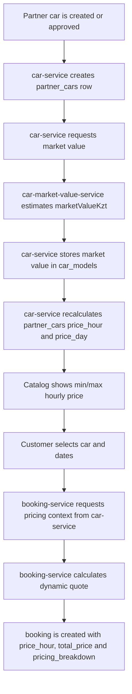

# Cars Pricing

## Краткий вывод

В текущей версии проекта цена автомобиля рассчитывается в несколько этапов. Партнер не задает финальную цену вручную: при создании или provision partner car поля `price_hour` и `price_day` сначала сохраняются как `null`, затем `car-service` пересчитывает их на основе рыночной стоимости модели автомобиля.

Финальная цена booking считается отдельно в `booking-service`. Она использует рыночную стоимость, рейтинг, количество доступных похожих автомобилей и количество дней до начала аренды.

## Где находится логика

| Component | Responsibility | Main code |
|---|---|---|
| `car-market-value-service` | Оценивает рыночную стоимость автомобиля по объявлениям kolesa.kz. | `backend/internal/car-market-value-service/src/app/services/market_value.py` |
| `car-service` | Сохраняет market value в `car_models` и рассчитывает витринные `price_hour` / `price_day` для `partner_cars`. | `PartnerCarDisplayPriceCalculator.cs`, `PartnerCarDisplayPricingService.cs`, `CarMarketValueSyncService.cs` |
| `booking-service` | Рассчитывает dynamic price quote для конкретного периода аренды и сохраняет breakdown в booking. | `DynamicPricingService.cs`, `BookingService.cs` |
| External frontend | Показывает price estimate, booking price preview и pricing breakdown пользователю. | `BookingModal.vue`, `BookingPaymentView.vue`, `BookingDetailView.vue` |

## Общий процесс расчета цены



## 1. Market value calculation

Market value считается в `car-market-value-service`. Сервис строит URL для kolesa.kz по `brand`, `model`, `year`, например:

```text
/cars/{brand}/{model}/?year[from]={year}&year[to]={year}
```

По умолчанию сервис просматривает до 3 страниц объявлений (`KOLESA_MAX_PAGES`). Из HTML берутся цены, из текста цены извлекаются только цифры. Конвертации валют в коде нет: результат трактуется как KZT.

Основная формула:

```text
marketValueKzt = round(median(filteredPrices))
```

Перед расчетом median сервис удаляет выбросы через IQR:

```text
Q1 = percentile(sortedPrices, 0.25)
Q3 = percentile(sortedPrices, 0.75)
IQR = Q3 - Q1

lowerBound = max(0, Q1 - 1.5 * IQR)
upperBound = Q3 + 1.5 * IQR

filteredPrices = prices where lowerBound <= price <= upperBound
```

Если после фильтрации остается слишком мало значений, сервис возвращается к исходному отсортированному списку. Минимально приемлемый размер выборки:

```text
minimumViableSize = max(3, ceil(sampleCount * 0.6))
```

Confidence определяется по количеству цен после фильтрации:

| Filtered sample count | Confidence |
|---:|---|
| `>= 15` | `high` |
| `>= 7` | `medium` |
| `< 7` | `low` |

Результат market value сохраняется в `car-db` в таблице/модели `car_models`:

```text
market_value_kzt
market_value_fetched_at
market_value_source
market_value_source_url
market_value_sample_count
market_value_filtered_sample_count
market_value_confidence
market_value_status
market_value_error
```

## 2. Display price in car-service

После получения `marketValueKzt` сервис `car-service` рассчитывает витринную цену для `partner_cars`. Эта цена используется в каталоге, в карточках автомобилей, в подборе машин и как ориентир для пользователя.

Формула находится в `PartnerCarDisplayPriceCalculator`:

```text
effectiveRating = partnerCar.Rating ?? carModel.Rating ?? 3.0

ratingCoefficient = 1 + (effectiveRating - 3.0) * 0.05

priceHour = round(marketValueKzt * 0.0001 * ratingCoefficient, 2)

priceDay = round(priceHour * 24 * 0.90, 2)
```

Значение `0.0001` означает, что базовая часовая цена берется как 0.01% от рыночной стоимости автомобиля. Рейтинг влияет на цену на 5% за каждый пункт относительно базового рейтинга `3.0`.

Пример:

```text
marketValueKzt = 10 000 000
effectiveRating = 4.0

ratingCoefficient = 1 + (4.0 - 3.0) * 0.05 = 1.05
priceHour = round(10 000 000 * 0.0001 * 1.05, 2) = 1050.00 KZT
priceDay = round(1050.00 * 24 * 0.90, 2) = 22680.00 KZT
```

Если `marketValueKzt` отсутствует или меньше/равен нулю, `priceHour` и `priceDay` остаются `null`.

## 3. Catalog price

В каталоге цена не пересчитывается заново. `car-service` берет уже сохраненные `partner_cars.price_hour` и группирует доступные машины по модели.

Для `available-models` используются:

```text
minPriceHour = min(priceHour of available partner cars)
maxPriceHour = max(priceHour of available partner cars)
availableCarsCount = count(available partner cars)
```

Для car model response в административных сценариях может использоваться средняя цена:

```text
averagePriceHour = average(partnerCars.price_hour)
averagePriceDay = average(partnerCars.price_day)
```

Также есть commercial badges, но они не меняют цену. Это только UI/marketing labels:

```text
econom: priceHour <= 4000
premium: priceHour >= 8000
deal: priceHour <= referencePriceHour * 0.9
      and referencePriceHour - priceHour >= 500
```

## 4. Booking dynamic price

Финальная цена аренды считается в `booking-service`, в `DynamicPricingService`. Этот расчет используется в двух местах:

```text
GET /bookings/price-preview
POST /bookings
```

Перед расчетом `booking-service` получает pricing context из `car-service` через internal endpoint:

```text
GET /internal/partner-cars/{partnerCarId}/pricing-context
Header: X-Internal-Api-Key
```

В pricing context входят:

```text
partnerCarId
partnerUserId
carModelId
marketValueKzt
rating
currentAvailableCarsCount
isMarketValueStale
```

Полная формула booking price:

```text
rating = context.Rating <= 0 ? 3.0 : context.Rating

billableHours = max(1, ceil((endTime - startTime).TotalHours))

daysBeforeBooking = max(0, floor((startTime - quotedAtUtc).TotalDays))

ratingCoefficient =
    1 + (rating - 3.0) * 0.05

advanceBookingCoefficient =
    1 - min(0.2, 0.01 * daysBeforeBooking)

availabilityCoefficient =
    max(0.8, min(1.2, 1 + (20 - currentAvailableCarsCount) * 0.02))

priceHour =
    round(
        marketValueKzt
        * 0.0001
        * ratingCoefficient
        * advanceBookingCoefficient
        * availabilityCoefficient,
        2
    )

totalPrice =
    round(priceHour * billableHours, 2)
```

Meaning of coefficients:

| Coefficient | Meaning |
|---|---|
| `ratingCoefficient` | Higher-rated cars become more expensive. Each rating point above/below `3.0` changes price by 5%. |
| `advanceBookingCoefficient` | Earlier bookings get a discount: 1% per day before trip, capped at 20%. |
| `availabilityCoefficient` | Low availability increases price, high availability decreases price. The coefficient is capped between `0.8` and `1.2`. |
| `billableHours` | Rental duration in hours, rounded up, with minimum 1 hour. |

Example:

```text
marketValueKzt = 10 000 000
rating = 4.0
daysBeforeBooking = 5
currentAvailableCarsCount = 8
duration = 27.5 hours

ratingCoefficient = 1 + (4.0 - 3.0) * 0.05 = 1.05
advanceBookingCoefficient = 1 - min(0.2, 0.01 * 5) = 0.95
availabilityCoefficient = min(1.2, 1 + (20 - 8) * 0.02) = 1.2
billableHours = ceil(27.5) = 28

priceHour = round(10 000 000 * 0.0001 * 1.05 * 0.95 * 1.2, 2)
priceHour = 1197.00 KZT

totalPrice = round(1197.00 * 28, 2)
totalPrice = 33516.00 KZT
```

## 5. What is stored after booking creation

When booking is created, `booking-service` stores the calculated quote in `booking-db`.

Main booking fields:

```text
bookings.price_hour
bookings.total_price
bookings.pricing_breakdown
```

`pricing_breakdown` is JSONB and contains:

```text
quotedAtUtc
marketValueKzt
rating
currentAvailableCarsCount
daysBeforeBooking
billableHours
ratingCoefficient
advanceBookingCoefficient
availabilityCoefficient
quotedPriceHour
quotedTotalPrice
currency
isMarketValueStale
```

This is important for auditability: even if market value, rating or availability later changes, the booking keeps the exact calculation snapshot used at creation time.

## 6. Error and stale data behavior

If market value cannot be found during `/cars/price-estimate`, `car-service` returns `404`.

If market value is missing or invalid during booking quote calculation, `booking-service` rejects the quote with:

```text
Market value is not available for this car.
```

If market value exists but is stale, booking price is still calculated from the last available snapshot. The response and saved breakdown set:

```text
isMarketValueStale = true
```

Current refresh settings in `car-service`:

```text
RefreshAfterHours = 24
PollIntervalSeconds = 600
BatchSize = 20
```

## 7. What is not part of the pricing formula

The current code does not show a separate tax, commission, insurance, coupon, payment fee or partner-defined manual pricing formula for the main booking price.

`payment-service` does not recalculate the car rental price. It uses the booking amount that was already calculated and stored by `booking-service`.

AI search and car recommendation do not calculate the final price. They can use existing `priceHour` as one of the ranking/display inputs, but the final booking amount is produced by `DynamicPricingService`.

## Source code references

Main files used for this description:

```text
backend/internal/car-market-value-service/src/app/services/market_value.py
backend/internal/car-market-value-service/src/app/api.py
backend/internal/car-market-value-service/src/app/schemas.py
backend/external/car-service/src/CarService.Domain/Calculations/PartnerCarDisplayPriceCalculator.cs
backend/external/car-service/src/CarService.Infrastructure/Services/PartnerCarDisplayPricingService.cs
backend/external/car-service/src/CarService.Infrastructure/Services/CarMarketValueSyncService.cs
backend/external/car-service/src/CarService.Infrastructure/Services/PartnerCarService.cs
backend/external/car-service/src/CarService.Api/Controllers/CarMatchingController.cs
backend/external/booking-service/src/BookingService.Infrastructure/Services/DynamicPricingService.cs
backend/external/booking-service/src/BookingService.Infrastructure/Services/BookingService.cs
backend/external/booking-service/src/BookingService.Domain/ValueObjects/BookingPricingBreakdownSnapshot.cs
frontend/external/src/components/BookingModal.vue
frontend/external/src/views/BookingPaymentView.vue
frontend/external/src/views/BookingDetailView.vue
```
