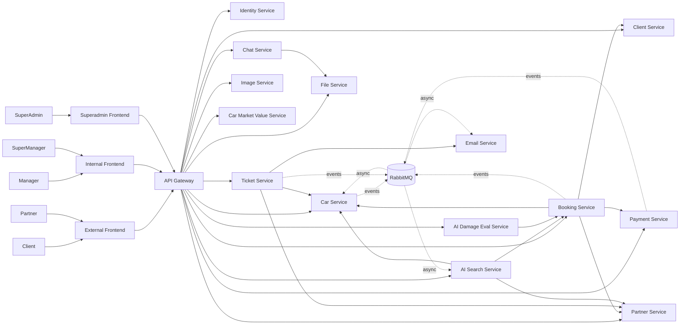
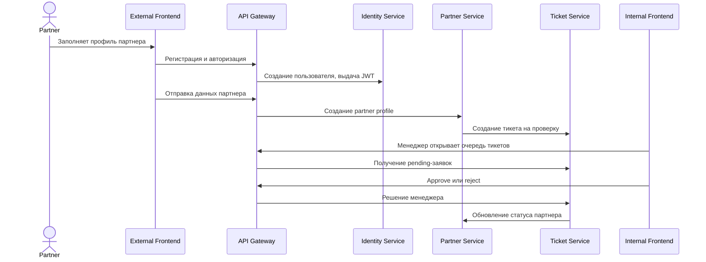
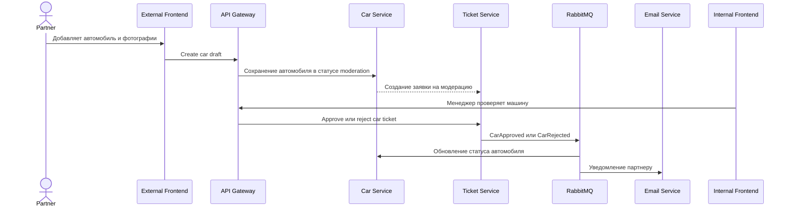
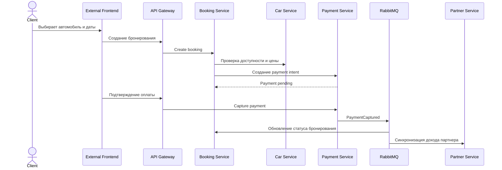
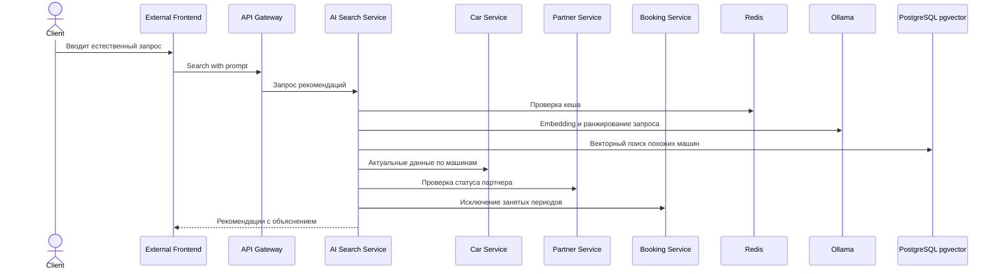
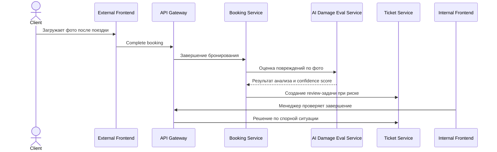
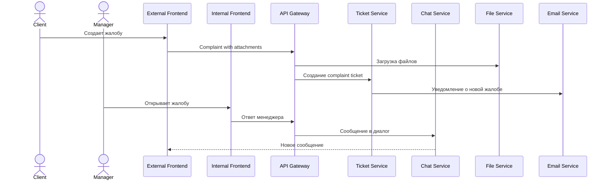
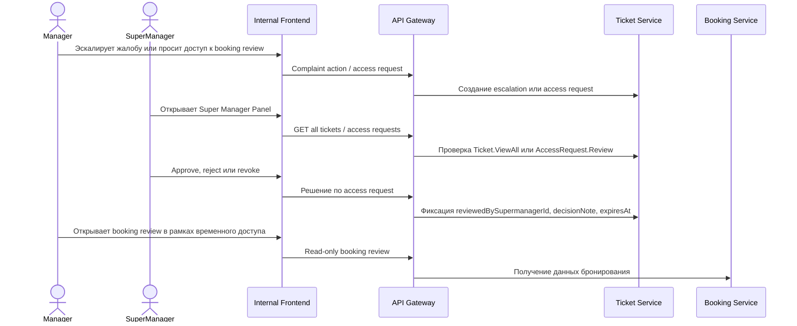

# AutoRent: презентационное описание проекта

## 1. Что это за проект

**AutoRent** - это микросервисная платформа для краткосрочной аренды автомобилей. Проект объединяет клиентский каталог, кабинет партнера, внутреннюю CRM, платежные процессы, обработку заявок, чат, файловое хранилище, AI-поиск и AI-оценку повреждений автомобиля.

Главная идея системы - показать полный жизненный цикл аренды автомобиля в одном продукте:

- клиент находит автомобиль, получает AI-рекомендации, бронирует и оплачивает поездку;
- партнер добавляет автомобили и отслеживает доход;
- менеджеры проверяют партнеров, машины, жалобы, завершение поездок и спорные ситуации;
- супер-менеджеры контролируют работу менеджеров, видят все тикеты и утверждают доступ к чувствительным booking-данным;
- супер-администратор управляет пользователями, ролями и доступами;
- техническая команда видит состояние системы через метрики, логи и трассировки.

Проект построен как демонстрация современной backend/frontend архитектуры: отдельные сервисы владеют своими данными, взаимодействуют через HTTP и RabbitMQ, используют централизованную идентификацию, а критичные бизнес-события проходят через outbox-паттерн.

## 2. Ключевая ценность

AutoRent закрывает не только базовый сценарий аренды, но и операционные процессы вокруг него. В реальном бизнесе аренда автомобиля не заканчивается на кнопке "забронировать": нужно проверять партнеров, модерировать автомобили, принимать платежи, фиксировать повреждения, решать жалобы, отправлять уведомления и понимать, что происходит в системе.

Поэтому проект сделан не как монолитная демо-форма, а как набор связанных сервисов:

- **для клиента** - поиск, рекомендации, бронирование, оплата, завершение поездки и обращения;
- **для партнера** - регистрация, добавление автомобилей, финансовая статистика и заявки;
- **для менеджера** - очереди на проверку, жалобы, модерация, ручные решения;
- **для супер-менеджера** - надзор за тикетами, менеджерами, эскалациями и доступом к booking review;
- **для администратора и супер-администратора** - управление пользователями, ролями и правами;
- **для эксплуатации** - observability-стек с метриками, логами и трассировками.

## 3. Пользовательские контуры

| Контур | Папка | Назначение |
| --- | --- | --- |
| External Frontend | `frontend/external` | Публичный сайт, клиентский кабинет и кабинет партнера |
| Internal Frontend | `frontend/internal` | CRM для менеджеров и администраторов операционных процессов |
| Superadmin Frontend | `frontend/superadmin` | Управление пользователями, ролями и разрешениями |
| API Gateway | `backend/shared/api-gateway` | Единая точка входа в backend, маршрутизация и технические middleware |

Роли в системе:

| Роль | Что делает |
| --- | --- |
| `Client` | Ищет машины, бронирует, оплачивает, завершает поездку, создает обращения |
| `Partner` | Регистрируется как владелец, добавляет машины, отслеживает заявки и доход |
| `Manager` | Проверяет партнеров, машины, завершения поездок, жалобы и тикеты |
| `SuperManager` / `supermanager` | Видит все тикеты, контролирует менеджеров, работает с эскалациями и approve/reject/revoke запросов доступа к booking review |
| `Admin` | Управляет внутренними операционными процессами |
| `SuperAdmin` | Управляет пользователями, ролями и правами доступа |

## 4. Система на одном слайде



Идея архитектуры: пользовательские интерфейсы не знают внутреннюю топологию сервисов. Они обращаются в API Gateway, а gateway проксирует запросы в нужный сервис. Сервисы синхронно вызывают друг друга для чтения и команд, а бизнес-события публикуют в RabbitMQ, чтобы не связывать критичные операции жесткой цепочкой HTTP-зависимостей.

## 5. Состав сервисов

| Группа | Сервисы | Ответственность |
| --- | --- | --- |
| Edge | `api-gateway` | Маршруты, CORS, rate limiting, TLS, tracing, metrics, logs |
| Identity | `identity-service` | Пользователи, JWT, JWKS, роли, permissions, внутренние API keys |
| Customer domain | `car-service`, `booking-service`, `client-service` | Машины, бронирования, клиентские профили |
| Partner domain | `partner-service`, `ticket-service` | Партнеры, заявки, модерация, жалобы, операционные очереди |
| Payments | `payment-service` | Платежи, возвраты, wallet, mock-эквайринг, outbox-синхронизация |
| Communication | `chat-service`, `email-service` | Диалоги, сообщения, email-уведомления |
| Files and media | `file-service`, `image-service` | Файлы обращений, изображения машин, публичные media URL |
| AI services | `ai-search-service`, `ai-damage-eval-service`, `car-market-value-service` | Рекомендации, векторный поиск, оценка повреждений, рыночная стоимость |
| Platform | PostgreSQL, MongoDB, Redis, RabbitMQ, Ollama, Prometheus, Grafana, Loki, Tempo | Данные, очереди, кеш, LLM, наблюдаемость |

## 6. Основные сценарии взаимодействия

### 6.1 Регистрация партнера и проверка



Этот сценарий показывает разделение ответственности: `partner-service` хранит профиль партнера, а `ticket-service` управляет процессом проверки и решением менеджера.

### 6.2 Добавление автомобиля партнером



Автомобиль не становится доступным в каталоге сразу. Он проходит модерацию, что делает систему ближе к реальному car-sharing процессу.

### 6.3 Бронирование и платеж



Платежный контур отделен от бронирования. Это позволяет развивать финансовую часть независимо: добавлять возвраты, кошелек, комиссии, отчеты и интеграцию с реальным провайдером.

### 6.4 AI-рекомендации автомобилей



AI-поиск не заменяет доменные сервисы, а использует их как источники правды. Поэтому рекомендации учитывают актуальную доступность, статус партнера и данные автомобиля.

### 6.5 Завершение поездки и AI-оценка повреждений



AI-оценка работает как помощник менеджера, а не как единственный источник решения. Итоговое решение по спорным случаям остается за внутренним контуром.

### 6.6 Жалобы, чат и файлы



Жалобы связаны с тикетами, файлами и чатом. Это позволяет вести историю обращения, хранить доказательства и отделять коммуникацию от бизнес-статусов.

### 6.7 Супер-менеджер, эскалации и доступ к booking review



`supermanager` - это отдельная роль, а не синоним `superadmin`. Она наследует менеджерские права, получает обзор всех тикетов через `Ticket.ViewAll`, видит список менеджеров, а также утверждает, отклоняет и отзывает временные доступы к данным бронирования через `AccessRequest.Review`. Это разделяет операционный контроль и глобальное администрирование пользователей.

## 7. Архитектурные особенности

### Динамическое ценообразование

Динамическое ценообразование - это расчет финальной стоимости аренды под конкретную машину, дату начала, дату окончания, рейтинг и текущий спрос. В каталоге клиент видит базовую отображаемую цену, а перед оплатой `booking-service` получает полный pricing context из `car-service` и фиксирует расчет в `pricing_breakdown` бронирования.

Источник базовой стоимости - `car-market-value-service`. Он получает `brand + model + year`, собирает объявления с `kolesa.kz`, парсит цены, удаляет выбросы методом IQR, считает медиану и возвращает `marketValueKzt`. Уверенность (`low`, `medium`, `high`) зависит от количества объявлений после фильтрации.

Формула отображаемой цены в каталоге:

```text
ratingCoefficient = 1 + (rating - 3.0) * 0.05
displayPriceHour = round2(marketValueKzt * 0.0001 * ratingCoefficient)
displayPriceDay = round2(displayPriceHour * 24 * 0.90)
```

Формула цены конкретного бронирования:

```text
billableHours = max(1, ceil((endTime - startTime).TotalHours))
daysBeforeBooking = max(0, floor((startTime - quotedAtUtc).TotalDays))

ratingCoefficient = 1 + (rating - 3.0) * 0.05
advanceBookingCoefficient = 1 - min(0.20, 0.01 * daysBeforeBooking)
availabilityCoefficient = clamp(1 + (20 - currentAvailableCarsCount) * 0.02, 0.80, 1.20)

priceHour = round2(
  marketValueKzt
  * 0.0001
  * ratingCoefficient
  * advanceBookingCoefficient
  * availabilityCoefficient
)

totalPrice = round2(priceHour * billableHours)
```

Смысл коэффициентов:

- `ratingCoefficient` повышает цену для машин с рейтингом выше 3.0 и снижает для машин ниже 3.0;
- `advanceBookingCoefficient` дает скидку за раннее бронирование: 1% за день заранее, максимум 20%;
- `availabilityCoefficient` отражает дефицит: когда доступных машин меньше 20, цена растет, когда больше - снижается, но только в диапазоне от `0.80` до `1.20`;
- `billableHours` округляет длительность аренды вверх и не дает бронированию стоить меньше одного часа.

### Автоподбор машин без ИИ

Автоподбор - это deterministic matching, который выбирает конкретную машину партнера по выбранной модели и временному интервалу. Он нужен, когда клиент выбрал модель из каталога, но еще не выбрал конкретный `partnerCarId`, либо когда нужно автоматически распределить спрос между несколькими одинаковыми машинами разных партнеров.

Алгоритм работает в `car-service` через `POST /cars/match`:

1. Фронтенд отправляет `modelId`, `startTime`, `endTime`.
2. `car-service` выбирает активные `partner_cars` с этим `modelId` и `status=Available`.
3. `car-service` обращается в `booking-service` через внутренний endpoint `POST /internal/bookings/check-availability`.
4. Занятые машины исключаются.
5. Если свободных машин нет, возвращаются ближайшие `suggestedStartTimesUtc`.
6. Если кандидаты есть, сервис ранжирует их и возвращает лучший `partnerCarId`.

Формула ранжирования:

```text
partnerLoadScore = 1 - normalize(partnerBookingsForOwner)
ratingScore = clamp(rating / 5, 0, 1)
bookingCountScore = normalize(bookingsForThisCar)
priceScore = 1 - normalize(priceHour)

totalScore =
  partnerLoadScore * 0.35
  + ratingScore * 0.30
  + bookingCountScore * 0.20
  + priceScore * 0.15
```

После расчета кандидаты сортируются по `totalScore`, затем по рейтингу, цене и id. Такой подбор одновременно учитывает справедливое распределение нагрузки между партнерами, качество машины, популярность конкретного автомобиля и цену.

### ИИ-подбор машин

ИИ-подбор - это отдельный сценарий в `ai-search-service`, где клиент пишет свободный текст: например, "нужна семейная машина до 6000 тенге в час" или "что-то комфортное для деловой встречи". Сервис превращает такой запрос в структурированные фильтры, ищет релевантные машины и возвращает не просто список, а рекомендации с объяснениями.

Как работает pipeline:

1. `POST /ai/recommendations` приходит через API Gateway.
2. Сервис проверяет Redis-кэш и историю диалога.
3. Intent classifier определяет, это поиск, уточнение или обычный чат.
4. Heuristic parser и LLM parser извлекают `maxBudgetPerHour`, `passengers`, `transmission`, `minRating`, `preferredStyles`, `excludedStyles`, `preferredBrands`, `minYear`, `maxYear`, даты и требование доступности.
5. Индекс машин строится из данных `car-service`: карточка машины превращается в lexical document и embedding.
6. PostgreSQL + pgvector выполняет hybrid retrieval: векторный поиск и лексический поиск.
7. Сервис проверяет доступность через `booking-service`, применяет жесткие фильтры и бизнес-ранжирование.
8. Ответ формируется с причинами: "укладывается в бюджет", "совпадает по стилю", "подходит по количеству мест", "высокий рейтинг".

Формула hybrid retrieval использует reciprocal rank fusion:

```text
rrfScore = 0.4 / (60 + vectorRank) + 0.6 / (60 + lexicalRank)
```

Финальный скоринг кандидата:

```text
finalScore = vectorScore * 0.50 + lexicalScore * 0.20 + businessScore * 0.30 + personalBoost
```

`businessScore` повышается за попадание в бюджет, количество мест, коробку передач, минимальный рейтинг, стиль, год выпуска и общий рейтинг. В отличие от обычного автоподбора, AI-подбор работает не только с моделью и датами, а с намерением пользователя и смыслом запроса.

### Определитель побитости машины

Определитель побитости - это `ai-damage-eval-service`, внутренний FastAPI-сервис для проверки фотографий после завершения бронирования. Он не начисляет штраф автоматически. Его задача - дать менеджеру advisory-оценку: есть ли на фото видимые повреждения, какие именно, на каком ракурсе и с какой уверенностью.

Как работает проверка:

1. Клиент завершает бронирование и загружает пять slot-labelled фото: `front`, `back`, `side_left`, `side_right`, `interior`.
2. `booking-service` получает snapshot машины из `car-service`: модель, цвет и `partnerCarId`.
3. `booking-service` вызывает `POST /inspect-session` в `ai-damage-eval-service` с `X-Internal-Api-Key`.
4. AI-сервис проверяет формат, качество, закрытие машины, соответствие цвета и car context.
5. Если валидных фото меньше `MIN_PHOTOS` (по умолчанию 4), возвращается `INVALID_SESSION`, а клиент получает `400` с деталями по проблемным фото.
6. На валидных фото запускается YOLO pipeline: `yolov8n.pt` для обнаружения машины и `yolov8m_damage_v1.pt` для повреждений.
7. Пересекающиеся detections дедуплицируются по slot через IoU.
8. Сервис возвращает `OK`, `DAMAGES_FOUND` или `INVALID_SESSION`.
9. `booking-service` создает review ticket, а менеджер принимает финальное решение по штрафу или закрытию бронирования.

Сервис специально сделан advisory-only и fail-open для booking flow: если AI недоступен, отвечает 5xx или не успевает за timeout, тикет все равно создается, но с ручной проверкой.

### Database per service

Каждый доменный сервис владеет своей базой или коллекцией данных. Это снижает связанность между командами и сервисами: например, `booking-service` не меняет таблицы платежей напрямую, а взаимодействует с `payment-service`.

### API Gateway как единая точка входа

Фронтенды обращаются к одному gateway. Он скрывает внутренние адреса сервисов, применяет CORS, rate limiting, прокидывает trace context, собирает технические логи и метрики.

### Identity и permissions

`identity-service` выпускает JWT, публикует JWKS, хранит пользователей, роли и права. Остальные сервисы проверяют токены и могут использовать внутренние API keys для service-to-service вызовов. Роль `supermanager` наследует права `manager`, получает `Ticket.ViewAll`, `User.View`, права data-manager и отдельные права на `AccessRequest.Review`, `Payment.View`, `Payment.Update`.

### Асинхронные события через RabbitMQ

События вроде `PaymentCaptured`, `CarApproved`, `BookingCompleted` и уведомлений не должны блокировать основной пользовательский сценарий. Для этого используется RabbitMQ и outbox-подход: сервис сначала надежно фиксирует событие у себя, а затем публикует его в брокер.

### Наблюдаемость

Проект включает observability-стек:

- **Prometheus** - метрики сервисов;
- **Grafana** - dashboards;
- **Loki** - централизованные логи;
- **Tempo** - distributed tracing;
- **OpenTelemetry Collector** - прием и маршрутизация traces/metrics;
- **Promtail** - доставка логов.

Это важно для презентации: система демонстрирует не только бизнес-функции, но и готовность к эксплуатации.

### Устойчивость к сбоям

Некоторые функции спроектированы как advisory или degrade-friendly:

- AI-рекомендации могут вернуться к эвристическому разбору и гибридному поиску, если LLM недоступна;
- AI-оценка повреждений помогает менеджеру, но не блокирует ручную проверку;
- уведомления и синхронизации проходят через очередь и могут быть повторены;
- gateway централизует rate limiting и техническую защиту.

## 8. Данные и инфраструктура

| Компонент | Использование |
| --- | --- |
| PostgreSQL | Основные транзакционные данные сервисов |
| pgvector | Векторные embeddings для AI-поиска |
| MongoDB | Чаты, сообщения и документные сценарии |
| Redis | Кеш, быстрые lookup-операции, временные состояния |
| RabbitMQ | Асинхронные события и интеграция между сервисами |
| Ollama | Локальные LLM/embedding-модели |
| Docker Compose | Запуск полной среды разработки |
| Prometheus/Grafana/Loki/Tempo | Наблюдаемость и диагностика |

## 9. Сильные стороны проекта

- Микросервисная архитектура с четким разделением доменов.
- Полный цикл аренды: поиск, бронирование, оплата, проверка, завершение, жалобы.
- Несколько пользовательских контуров: клиент, партнер, менеджер, супер-менеджер, администратор, супер-администратор.
- Динамическое ценообразование учитывает рыночную стоимость, рейтинг, раннее бронирование и текущую доступность.
- Есть два режима подбора: deterministic автоподбор конкретной машины и AI-подбор по свободному тексту.
- AI-функции встроены в реальные продуктовые сценарии.
- Используется event-driven подход и outbox для надежной интеграции.
- Есть observability-стек, полезный для диагностики и презентации инженерной зрелости.
- Сервисы можно развивать независимо: платежи, AI, тикеты, каталог и identity имеют собственные зоны ответственности.

## 10. Где смотреть детали

- [Runtime architecture](./project-architecture.md) - подробная архитектура окружения и инфраструктуры.
- [Root README](../README.md) - быстрый старт, роли, публичные endpoints и карта репозитория.
- [Backend README](../backend/README.md) - карта backend-сервисов и инструкции по сборке.
- [Observability README](../ops/observability/README.md) - Prometheus, Grafana, Loki, Tempo и OpenTelemetry.
