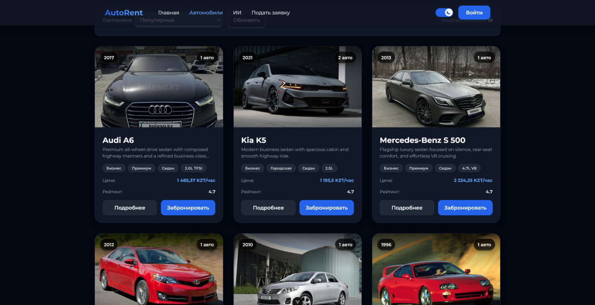
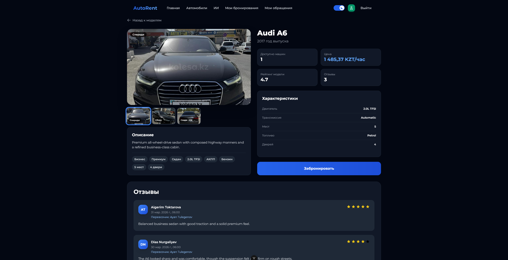
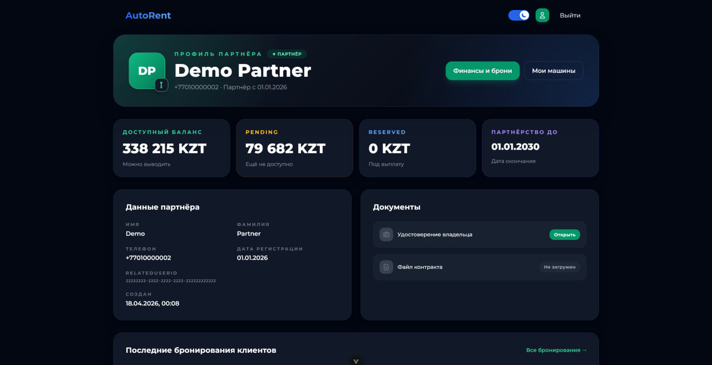
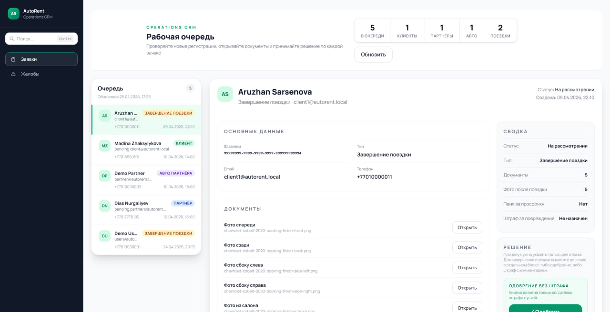
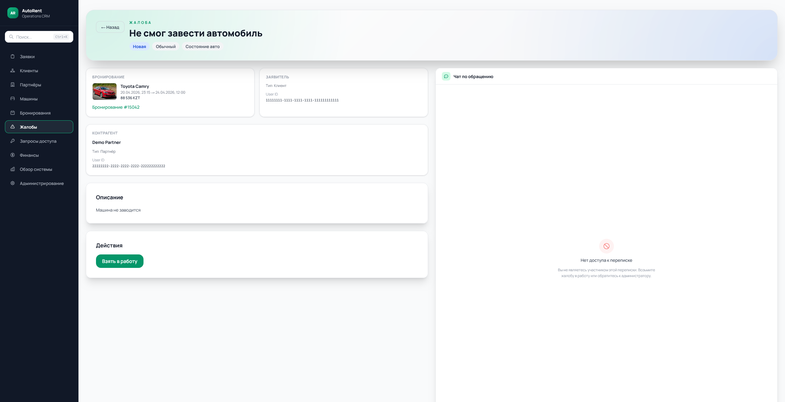
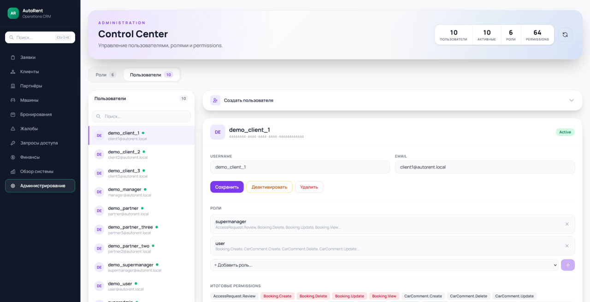

# Frontend Architecture

Дата анализа: 25 апреля 2026.

Документ описывает фактическое состояние frontend-части проекта по `package.json`, router-файлам, auth-store и Axios-конфигурации в трёх приложениях:

- `frontend/external`;
- `frontend/internal`;
- `frontend/superadmin`.

## 1. Frontend-приложения

| Приложение | Путь | Порт по умолчанию | Назначение |
|---|---|---:|---|
| External frontend | `frontend/external` | `5173` | Публичный сайт, customer/client flows, partner cabinet. |
| Internal frontend | `frontend/internal` | `5174` | Операционный интерфейс для manager, supermanager, admin, data-manager. |
| Superadmin frontend | `frontend/superadmin` | `5175` | Управление пользователями, ролями и permissions. |

Все три приложения работают как отдельные Vue/Vite single-page applications и ходят в backend через API Gateway. Default API URL:

- `http://localhost:9186`;
- override через `VITE_API_URL`.

## 2. Технологии frontend

### 2.1. Точно используемые технологии

| Технология | Используется | Где |
|---|---:|---|
| Vue 3 | Да | Все frontend-приложения. Версия `^3.5.25`. |
| Vite | Да | Все frontend-приложения. Версия `^7.2.4`. |
| TypeScript | Да | Все frontend-приложения. Версия `~5.9.0`. |
| Vue Router | Да | Все frontend-приложения. Версия `^4.6.3`. |
| Tailwind CSS | Да | Все frontend-приложения. Версия `^3.4.17`. |
| Axios | Да | Все frontend-приложения. Версия `^1.13.2`. |
| SignalR client | Да, но не везде | `external` и `internal`. Версия `^8.0.7`. |
| Pinia | Нет | В `package.json` отсутствует. |
| Vuex | Нет | В `package.json` отсутствует. |
| Nuxt | Нет | Проект использует plain Vue SPA через Vite. |
| React | Нет | Frontend полностью на Vue. |

### 2.2. State management

Pinia не используется. Auth state реализован через обычный `reactive` object из Vue:

- `frontend/external/src/store/auth.ts`;
- `frontend/internal/src/store/auth.ts`;
- `frontend/superadmin/src/store/auth.ts`.

Auth-store хранит:

- `accessToken` в `localStorage` под ключом `token`;
- `refreshToken` в `localStorage` под ключом `refreshToken`;
- JWT payload декодируется на frontend для проверки `exp`, `permissions`, `sub`, `actor_type`, `subject_type`.

Важно: frontend-декодирование JWT используется только для UI/route decisions. Настоящая security enforcement остаётся на backend-сервисах.

### 2.3. Axios layer

Все приложения используют Axios instance:

- request interceptor добавляет `Authorization: Bearer <token>`;
- response interceptor обрабатывает `401` и пробует refresh token;
- если refresh не удался, пользователь отправляется на `/login`.

External frontend дополнительно:

- преобразует PascalCase responses в camelCase;
- при `403` отправляет пользователя на `/403`.

## 3. External frontend routes

Файл маршрутов: `frontend/external/src/router/index.ts`.

External frontend важен для описания customer/client и partner сценариев.

### 3.1. Public routes

| Route | View | Назначение |
|---|---|---|
| `/` | `HomeView` | Главная страница. |
| `/login` | `LoginView` | Login. |
| `/apply` | `RegisterView` | Регистрация/заявка обычного пользователя. |
| `/register` | redirect to `/apply` | Совместимость старого route. |
| `/partner/apply` | `PartnerApplyView` | Подача заявки партнёра. |
| `/activate` | `ActivateAccountView` | Активация аккаунта. |
| `/cars` | `CarsView` | Каталог автомобилей. |
| `/cars/:id` | `CarDetailView` | Детальная страница car model. |
| `/cars/partner-cars/:id` | `PublicPartnerCarDetailView` | Публичная страница partner car. |
| `/ai` | `AiView` | AI search / recommendations UI. |
| `/car-recommendations` | redirect to `/ai` | Старый route для рекомендаций. |
| `/403` | `ForbiddenView` | Forbidden page. |
| `/:pathMatch(.*)*` | `NotFoundView` | Not found page. |

### 3.2. Authenticated customer/client routes

| Route | View | Назначение |
|---|---|---|
| `/bookings` | `MyBookingsView` | Список собственных бронирований. |
| `/bookings/:id` | `BookingDetailView` | Детали бронирования. |
| `/bookings/:id/payment` | `BookingPaymentView` | Страница оплаты booking. |
| `/bookings/:id/complete` | `BookingCompletionView` | Завершение booking и completion review. |
| `/complaints` | `MyComplaintsView` | Мои complaints. |
| `/complaints/:id` | `ComplaintDetailView` | Детали complaint. |
| `/profile` | `ProfileRouterView` | Определяет профиль по `actor_type` в JWT. |
| `/profile/user` | `ProfileView` | Client/customer profile. |

### 3.3. Partner routes

Эти routes требуют авторизацию и `actor_type=partner`.

| Route | View | Назначение |
|---|---|---|
| `/profile/partner` | `PartnerProfileView` | Профиль партнёра. |
| `/partner/cars` | `PartnerCarsView` | Список машин партнёра. |
| `/partner/cars/:id` | `PartnerCarDetailView` | Детали partner car. |
| `/partner/bookings` | `PartnerBookingsView` | Бронирования по машинам партнёра. |
| `/partner/me` | redirect to `/profile` | Старый route для совместимости. |

### 3.4. External route guards

External router использует `router.beforeEach`.

Проверки:

- если route имеет `meta.requiresAuth: true` и токена нет или он истёк, пользователь отправляется на `/login`;
- если route имеет `meta.actorType: "partner"`, frontend проверяет `auth.isActorType("partner")`;
- если пользователь не partner, partner route отправляет его на `/profile/user`;
- если partner открывает `/profile/user`, frontend отправляет его на `/profile/partner`.

External frontend не проверяет permissions на уровне router. Для external routes основной frontend guard строится вокруг:

- наличия валидного JWT;
- `actor_type`.

## 4. Internal frontend routes

Файл маршрутов: `frontend/internal/src/router/index.ts`.

Internal frontend важен для описания manager/supermanager/admin/data-manager сценариев. Здесь routes почти полностью permission-based.

### 4.1. Internal routes and required permissions

| Route | View | Required permission | Назначение |
|---|---|---|---|
| `/` | redirect | Depends on first available permission | Redirect на первый доступный раздел. |
| `/login` | `LoginView` | No permission | Login. |
| `/tickets` | `ManagerTicketsView` | `Ticket.View` | Очередь tickets для managers. |
| `/clients` | `ClientsTableView` | `Client.View` | Таблица клиентов. |
| `/clients/:id` | `ClientDetailView` | `Client.View` | Детали клиента. |
| `/partners` | `PartnersTableView` | `Partner.View` | Таблица партнёров. |
| `/partners/:id` | `PartnerDetailView` | `Partner.View` | Детали партнёра. |
| `/cars` | `CarsTableView` | `PartnerCar.View` | Таблица partner cars. |
| `/cars/:id` | `CarDetailView` | `PartnerCar.View` | Детали partner car. |
| `/bookings` | `BookingsTableView` | `Booking.View` | Таблица бронирований. |
| `/bookings/:id` | `BookingDetailView` | `Booking.View` | Детали booking. |
| `/complaints` | `ComplaintsQueueView` | `Complaint.View` | Очередь complaints. |
| `/complaints/access-requests` | `AccessRequestsView` | `AccessRequest.Review` | Запросы доступа к booking для complaint review. |
| `/complaints/:id` | `ComplaintDetailView` | `Complaint.View` | Детали complaint. |
| `/complaints/:complaintId/booking-review` | `BookingReviewView` | `Complaint.Review` | Review booking внутри complaint workflow. |
| `/finance` | `FinanceView` | `Partner.View` | Финансовый обзор партнёров. |
| `/super` | `SuperManagerView` | `Ticket.ViewAll` | Supermanager dashboard. |
| `/super/managers/:id` | `ManagerDetailView` | `Ticket.ViewAll` | Детали manager в supermanager area. |
| `/admin` | `AdminControlView` | `User.View` | Admin control panel для users/roles/permissions. |
| `/:pathMatch(.*)*` | redirect to `/login` | - | Fallback. |

### 4.2. Internal default route resolution

Для `/` internal frontend выбирает первый доступный route по permissions в таком порядке:

1. `/tickets` requires `Ticket.View`;
2. `/clients` requires `Client.View`;
3. `/partners` requires `Partner.View`;
4. `/cars` requires `PartnerCar.View`;
5. `/bookings` requires `Booking.View`;
6. `/complaints` requires `Complaint.View`;
7. `/finance` requires `Partner.View`;
8. `/super` requires `Ticket.ViewAll`;
9. `/admin` requires `User.View`.

Если токена нет, `/` редиректит на `/login`.

### 4.3. Internal route guards

Internal router использует `router.beforeEach`.

Проверки:

- если токен есть, frontend проверяет срок действия JWT через `auth.checkTokenValidity()`;
- если route требует auth, но токена нет, пользователь отправляется на `/login`;
- если route имеет `meta.requiredPermission`, frontend проверяет `auth.hasPermission(requiredPermission)`;
- если permission отсутствует, пользователь отправляется на первый доступный раздел через `resolveHome()` или на `/login`.

Internal frontend делает реальные frontend permission checks по JWT claim `permissions`.

## 5. Superadmin frontend routes

Файл маршрутов: `frontend/superadmin/src/router/index.ts`.

Superadmin frontend меньше остальных и сфокусирован на users/roles/permissions management.

| Route | View | Required permission | Назначение |
|---|---|---|---|
| `/` | redirect | Token-based | Если токен есть, redirect на `/users`, иначе `/login`. |
| `/login` | `LoginView` | No permission | Login. |
| `/users` | `SuperadminUsersView` | `User.View` | Управление пользователями, ролями и permissions. |
| `/:pathMatch(.*)*` | redirect to `/users` | - | Fallback. |

### 5.1. Superadmin route guards

Superadmin router использует `router.beforeEach`.

Проверки:

- если route требует auth и токена нет, пользователь отправляется на `/login`;
- если токен истёк, пользователь отправляется на `/login`;
- если route требует permission, frontend проверяет `auth.hasPermission(requiredPermission)`;
- `/users` требует `User.View`;
- если permission отсутствует, пользователь отправляется на `/login`.

В `superadmin` auth-store `hasPermission` также считает `*` универсальным permission.

## 6. Какие frontend routes стоит описать в дипломе

Для диплома не обязательно перечислять каждый fallback route. Лучше описывать routes как user journeys.

### 6.1. External customer/client journey

Ключевые routes:

- `/`;
- `/cars`;
- `/cars/:id`;
- `/cars/partner-cars/:id`;
- `/ai`;
- `/bookings`;
- `/bookings/:id`;
- `/bookings/:id/payment`;
- `/bookings/:id/complete`;
- `/complaints`;
- `/complaints/:id`;
- `/profile` and `/profile/user`.

Почему важны:

- показывают customer-facing catalog;
- показывают AI search;
- покрывают booking lifecycle;
- покрывают payment and completion review;
- покрывают complaint workflow;
- покрывают profile management.

### 6.2. External partner journey

Ключевые routes:

- `/partner/apply`;
- `/profile/partner`;
- `/partner/cars`;
- `/partner/cars/:id`;
- `/partner/bookings`.

Почему важны:

- показывают onboarding партнёра;
- показывают partner cabinet;
- покрывают управление машинами партнёра;
- связывают frontend с ticket moderation workflow;
- показывают partner-side booking/finance scenarios.

### 6.3. Internal operations journey

Ключевые routes:

- `/tickets`;
- `/clients`;
- `/clients/:id`;
- `/partners`;
- `/partners/:id`;
- `/cars`;
- `/cars/:id`;
- `/bookings`;
- `/bookings/:id`;
- `/complaints`;
- `/complaints/:id`;
- `/complaints/access-requests`;
- `/complaints/:complaintId/booking-review`;
- `/finance`;
- `/super`;
- `/admin`.

Почему важны:

- показывают manager operations;
- покрывают approve/reject moderation;
- покрывают complaint handling;
- показывают data-manager/supermanager scenarios;
- демонстрируют permission-based UI.

### 6.4. Superadmin journey

Ключевые routes:

- `/login`;
- `/users`.

Почему важны:

- показывают отдельную administrative surface;
- покрывают users/roles/permissions management;
- демонстрируют отделение superadmin UI от internal operations UI.

## 7. Frontend screenshots

Ниже добавлены актуальные screenshots из `images/front`. Пути указаны относительно файла `docs/front.md`.

### 7.1. Customer catalog and car details

Catalog page показывает customer-facing список доступных автомобилей и является основной точкой входа в browsing flow.

Car details page показывает подробную информацию об автомобиле и связывает catalog flow с booking flow.

### 7.2. Partner cabinet

Partner page показывает partner-facing интерфейс для профиля, машин партнёра и связанных partner workflows.

### 7.3. Internal manager workflows

Tickets page показывает internal moderation workflow для managers: review, approve and reject operational requests.

Complaint page показывает complaint handling workflow внутри internal operations UI.

### 7.4. Superadmin/admin area

Admin page показывает administrative UI для управления пользователями, ролями и permissions.

## 8. Frontend permission model

Frontend permission model строится на данных из JWT.

Используемые JWT claims на frontend:

- `sub`;
- `exp`;
- `permissions`;
- `actor_type`;
- `subject_type`.

External frontend дополнительно пытается получить email из claims:

- `email`;
- `preferred_username`;
- `unique_name`;
- `upn`;
- fallback: `localStorage.loginEmail`.

Но backend JWT сейчас не гарантирует наличие email claim, поэтому для диплома лучше не писать, что email является обязательной частью frontend authorization.

## 9. Что можно заявлять как реализованное

Можно писать:

- frontend состоит из трёх Vue 3 SPA;
- все приложения используют Vite, TypeScript, Vue Router, Tailwind CSS and Axios;
- external/internal используют SignalR client for realtime chat-related features;
- Pinia не используется, auth state реализован через Vue `reactive`;
- route guards реализованы во всех трёх приложениях;
- external routes проверяют auth and `actor_type`;
- internal and superadmin routes проверяют `permissions`;
- Axios automatically attaches Bearer token;
- Axios handles access token expiration through refresh token flow;
- frontend-level checks are UI guards, а backend services still enforce real authorization;
- screenshots для диплома лежат в `images/front` и подключены в этот документ.

## 10. Что не стоит заявлять

Не стоит писать:

- что frontend использует Pinia;
- что frontend использует Vuex;
- что проект использует Nuxt;
- что все roles имеют отдельные frontend-приложения;
- что `partner` является отдельной RBAC-role на frontend;
- что frontend authorization достаточно для security без backend checks;
- что email всегда есть внутри JWT.
