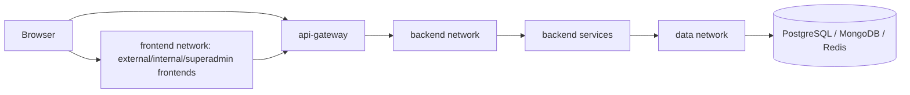

# Infrastructure And Deployment

Документ описывает фактическую инфраструктуру проекта по текущим файлам `docker-compose.yml`, env examples, observability configs и backend startup-коду.

## Источники

- `docker-compose.yml`
- `docker-compose.gpu.yml`
- `.env.example`
- `frontend/external/.env.example`
- `frontend/internal/.env.example`
- `frontend/superadmin/.env.example`
- `ops/observability/prometheus/prometheus.yml`
- `ops/observability/promtail/promtail.yml`
- `ops/observability/otel-collector/config.yml`
- `ops/observability/grafana/provisioning/datasources/prometheus.yml`
- `ops/observability/grafana/dashboards/autorent-observability.json`
- `backend/external/reverse-proxy-service/src/index.ts`
- `backend/external/reverse-proxy-service/src/docker-entrypoint.sh`
- `backend/external/booking-service/src/BookingService.Api/Program.cs`
- `backend/external/booking-service/src/BookingService.Infrastructure/Integrations/DamageEvaluationClient.cs`
- `backend/external/booking-service/src/BookingService.Infrastructure/Services/BookingService.cs`
- `backend/libraries/messaging-dotnet/src/AutoRent.Messaging/RabbitMq/RabbitMqTopology.cs`

## 1. Запуск проекта

Проект запускается через root `docker-compose.yml` из корня репозитория.

Основная команда запуска:

```bash
docker compose up --build
```

Для фонового запуска обычно используется:

```bash
docker compose up -d --build
```

Есть отдельный override-файл для GPU:

```bash
docker compose -f docker-compose.yml -f docker-compose.gpu.yml up -d
```

`docker-compose.gpu.yml` не является отдельным полноценным compose-файлом. Это override для `ollama`, который включает NVIDIA GPU reservation.

Также в проекте есть отдельные compose-файлы внутри сервисов и frontend-приложений. Они нужны скорее для isolated local development отдельных сервисов, а не для полного demo-запуска:

- `backend/external/booking-service/docker-compose.yaml`
- `backend/external/car-service/docker-compose.yaml`
- `backend/external/client-service/docker-compose.yaml`
- `backend/external/reverse-proxy-service/docker-compose.yml`
- `backend/internal/car-market-value-service/docker-compose.yaml`
- `backend/internal/file-service/docker-compose.yml`
- `backend/internal/partner-service/docker-compose.yaml`
- `backend/internal/payment-service/docker-compose.yaml`
- `backend/shared/email-service/docker-compose.yml`
- `backend/shared/identity-service/docker-compose.yaml`
- `backend/shared/image-service/docker-compose.yml`
- `frontend/external/docker-compose.yml`
- `frontend/internal/docker-compose.yml`
- `frontend/superadmin/docker-compose.yml`

Отдельного observability compose-файла нет: Prometheus, Grafana, Loki, Tempo, Promtail и OpenTelemetry Collector находятся прямо в root `docker-compose.yml`.

Все сервисы в root compose запускаются по умолчанию, потому что `profiles` не используются. Исключение по жизненному циклу: Flyway containers и `ollama-pull` являются one-shot контейнерами, они завершаются после миграций или скачивания моделей.

Optional services как Docker profiles не выделены. Практически optional только GPU override и ручной запуск subset-сервисов через `docker compose up <service>`.

## 2. Публичные порты

Основные demo/public ports:

| Component | Host port | Container port | Status |
| --- | ---: | ---: | --- |
| External frontend | `5173` | `5173` | confirmed |
| Internal frontend | `5174` | `5173` | confirmed |
| Superadmin frontend | `5175` | `5173` | confirmed |
| API Gateway HTTP | `9186` | `8080` | confirmed |
| API Gateway HTTPS | `9443` | `8443` | confirmed |
| Grafana | `3000` | `3000` | confirmed |
| Prometheus | `9090` | `9090` | confirmed |
| RabbitMQ Management UI | `15672` | `15672` | confirmed |
| Loki | `3100` | `3100` | confirmed |
| Tempo | `3200` | `3200` | confirmed |

Порты, которые лучше не показывать как public/demo ports:

| Component | Port | Recommendation |
| --- | ---: | --- |
| Ollama | `11434` | Не показывать как public port. В root compose он только `expose`, без host `ports`; доступен внутри Docker network. |
| ai-search-db | `1836 -> 5432` | Технически опубликован на host для dev/debug, но это database port, не public demo API. Лучше вынести в internal/debug ports. |
| Redis / ai-search-redis | `6380 -> 6379` | Технически опубликован на host для dev/debug, но не public demo API. Лучше вынести в internal/debug ports. |

RabbitMQ AMQP `5672` тоже не опубликован наружу; опубликован только Management UI `15672`.

## 3. Docker-сети

Используются три сети:

| Network | Purpose | Internal |
| --- | --- | --- |
| `frontend` | Frontend apps and API gateway edge access | no |
| `backend` | Service-to-service communication, gateway to backend, observability | no |
| `data` | Databases, Flyway, DB-backed services | yes, `internal: true` |

`data` network действительно объявлена как:

```yaml
data:
  internal: true
```

Network placement:

- Frontend apps находятся только в `frontend`.
- API Gateway подключён к `frontend` и `backend`.
- Backend services, которым нужна БД, обычно подключены к `backend` и `data`.
- Stateless/supporting backend services без БД находятся только в `backend`.
- Databases и Flyway containers находятся только в `data`.

Важно: `data` является internal Docker network, поэтому обычные database services не доступны из внешней сети Docker. Но `ai-search-db` и `ai-search-redis` дополнительно имеют host port mappings для dev/debug, поэтому это исключение из строгого правила "database only internal".



## 4. Backend runtime

Не все backend containers слушают `8080`, но большинство application services слушают именно `8080`.

Слушают `8080`:

- `identity-service`
- `chat-service`
- `car-market-value-service`
- `car-service`
- `ai-search-service`
- `booking-service`
- `client-service`
- `partner-service`
- `payment-service`
- `ticket-service`
- `email-service`
- `image-service`
- `file-service`

Исключения:

- `api-gateway`: HTTP `8080`, HTTPS `8443` внутри контейнера.
- `ai-damage-eval-service`: `8000` внутри контейнера.
- `ollama`: `11434` внутри Docker network.
- Databases, RabbitMQ, Redis и observability services используют свои native ports.

Наружу из backend application layer опубликован только `api-gateway`. Остальные backend application services доступны через Docker networks и gateway, но не напрямую с host machine.

Исключения по host ports не являются public backend APIs:

- `ai-search-db` опубликован на `1836` для dev/debug.
- `ai-search-redis` опубликован на `6380` для dev/debug.
- Observability ports и RabbitMQ Management UI опубликованы для monitoring/admin.

Frontend обращается к backend через:

```text
http://localhost:9186
```

Это задано в `VITE_API_URL` для external, internal и superadmin frontend apps.

HTTPS `9443` используется как dev/self-signed TLS endpoint. Gateway entrypoint генерирует self-signed certificate через `openssl`, если cert/key файлов ещё нет. Для production это нужно заменить нормальным TLS termination/certificate management.

## 5. Базы данных и storage

Фактический список database/cache services:

| Service | Image/version | Volume | Notes |
| --- | --- | --- | --- |
| `identity-db` | `postgres:16` | `identity_pgdata` | identity DB |
| `car-db` | `postgres:16` | `car_pgdata` | car DB |
| `booking-db` | `postgres:16` | `booking_pgdata` | booking DB |
| `client-db` | `postgres:16` | `client_pgdata` | client DB |
| `partner-db` | `postgres:16` | `partner_pgdata` | partner DB |
| `ticket-db` | `postgres:16` | `ticket_pgdata` | ticket DB |
| `payment-db` | `postgres:16` | `payment_pgdata` | payment DB |
| `ai-search-db` | `pgvector/pgvector:pg16` | `ai_search_pgdata` | PostgreSQL 16 with pgvector |
| `chat-db` | `mongo:7` | `chat_mongodata` | MongoDB 7 |
| `ai-search-redis` | `redis:7-alpine` | no persistent volume | Redis 7, configured as cache with `--save ""` |

Storage/infrastructure volumes:

| Volume | Used by |
| --- | --- |
| `file_uploads` | `file-service` local file storage mode |
| `image_uploads` | `image-service` local image storage mode |
| `rabbitmq_data` | RabbitMQ |
| `ollama_data` | Ollama models |
| `loki_data` | Loki |
| `tempo_data` | Tempo |
| `grafana_data` | Grafana |
| `gateway_logs`, `ticket_logs`, `identity_logs`, `email_logs`, `ai_search_logs`, `car_logs`, `booking_logs` | Promtail log collection |

Version confirmations:

- PostgreSQL version: `16`.
- MongoDB version: `7`.
- Redis version: `7-alpine`.
- `ai-search-db` uses `pgvector/pgvector:pg16`, so pgvector is part of the DB image.

File/image storage mode:

- `file-service` and `image-service` both support local storage and Google Cloud Storage.
- Current checked env configuration uses `USE_WEB_STORAGE=true`, so it is configured for Google Cloud Storage when valid GCS credentials are provided.
- Root compose still mounts `file_uploads` and `image_uploads`; those volumes are used when `USE_WEB_STORAGE=false`.
- For the diploma, describe Google Cloud Storage as cloud/optional deployment mode and local Docker volumes as the local/demo alternative. Do not include bucket names or credentials.

## 6. Миграции

Flyway is used for PostgreSQL-backed services.

Flyway containers:

| Flyway container | Database | Migration path |
| --- | --- | --- |
| `identity-flyway` | `identity-db` | `backend/shared/identity-service/src/Migrations` |
| `car-flyway` | `car-db` | `backend/external/car-service/src/Migrations` |
| `ai-search-flyway` | `ai-search-db` | `backend/external/ai-search-service/src/Migrations` |
| `booking-flyway` | `booking-db` | `backend/external/booking-service/src/Migrations` |
| `client-flyway` | `client-db` | `backend/external/client-service/src/Migrations` |
| `partner-flyway` | `partner-db` | `backend/internal/partner-service/src/Migrations` |
| `payment-flyway` | `payment-db` | `backend/internal/payment-service/src/Migrations` |
| `ticket-flyway` | `ticket-db` | `backend/internal/ticket-service/src/Migrations` |

Migrations run before application services. The pattern is:

```text
db service_healthy -> flyway service_completed_successfully -> application service
```

MongoDB `chat-db`, `file-service`, and `image-service` do not use Flyway in the root compose.

## 7. Healthchecks и порядок старта

Services with healthcheck in root compose:

- `rabbitmq`
- `identity-db`, `car-db`, `ai-search-db`, `booking-db`, `client-db`, `partner-db`, `payment-db`, `ticket-db`
- `chat-db`
- `ai-search-redis`
- `ollama`
- `identity-service`
- `chat-service`
- `car-market-value-service`
- `car-service`
- `ai-search-service`
- `ai-damage-eval-service`
- `booking-service`
- `client-service`
- `partner-service`
- `payment-service`
- `ticket-service`
- `email-service`
- `image-service`
- `file-service`
- `api-gateway`
- `frontend`, `internal-frontend`, `superadmin-frontend`

Services without explicit healthcheck include one-shot Flyway containers, `ollama-pull`, and most observability services.

`depends_on` with `condition: service_healthy` is used heavily. `service_completed_successfully` is used for Flyway containers and `ollama-pull`.

Important startup order examples:

- `identity-service` waits for `identity-db`, `identity-flyway`, and `rabbitmq`.
- `car-service` waits for `rabbitmq`, `car-db`, `car-flyway`, and `car-market-value-service`.
- `booking-service` waits for `rabbitmq`, `booking-db`, `booking-flyway`, and `payment-service`.
- `ticket-service` waits for `rabbitmq`, `ticket-db`, `ticket-flyway`, `identity-service`, `email-service`, `client-service`, `partner-service`, `file-service`, `image-service`, `car-service`, and `chat-service`.
- `api-gateway` waits for main backend services to become healthy.

AI search first startup:

- `ollama` starts and becomes healthy.
- `ollama-pull` downloads the chat and embedding models.
- Root compose defaults: `qwen2.5:1.5b` for chat and `bge-m3` for embeddings.
- `ai-search-service` waits for `ollama-pull` to complete, then starts.
- `AUTO_INDEX_ON_STARTUP=true`, so `ai-search-service` can index car data after startup.

AI damage evaluation startup:

- `ai-damage-eval-service` exposes `/ready`.
- Its healthcheck has a long `start_period` because model warmup can be slow.
- `/ready` succeeds only after model warmup has completed.
- `booking-service` does not block startup on `ai-damage-eval-service`.
- Booking completion flow can still work if AI damage eval is unavailable: infrastructure failures, timeout, 5xx, or unreachable AI service are converted to an `Unavailable` assessment and the ticket flow continues. Only a successful AI response with invalid session semantics blocks the completion submission.

## 8. Infrastructure services

RabbitMQ:

- Runs as `rabbitmq:3.13-management`.
- Management UI is published on `15672`.
- AMQP `5672` is exposed inside Docker network, not published to host.
- Exchange name defaults to `autorent.events`.
- The exchange/queues are declared by services at startup, not manually. .NET services use `RabbitMqTopology.DeclareExchange` / `DeclareBoundQueue`; Node services such as email and ai-search also call `assertExchange` and bind queues.

Ollama:

- Used by `ai-search-service` for local LLM/chat and embeddings.
- Not used by `ai-damage-eval-service`; damage evaluation uses its own model service.
- `ollama-pull` downloads `qwen2.5:1.5b` and `bge-m3` by default in root compose.

Observability:

- Observability stack starts together with the main root compose.
- There is no separate observability profile.
- Services included: Prometheus, OpenTelemetry Collector, Tempo, Loki, Promtail, Grafana.

## 9. Observability infrastructure

Prometheus scrape config:

| Job | Target |
| --- | --- |
| `prometheus` | `prometheus:9090` |
| `api-gateway` | `api-gateway:8080/metrics` |
| `ticket-service` | `ticket-service:8080/metrics` |
| `identity-service` | `identity-service:8080/metrics` |

The user-facing confirmation is correct: Prometheus scrapes `api-gateway`, `identity-service`, and `ticket-service`. It also scrapes Prometheus itself.

Note: `ai-search-service` has a `/metrics` endpoint in code, but it is not included in the current `prometheus.yml` scrape config.

OpenTelemetry traces:

| Service | OTLP target |
| --- | --- |
| `api-gateway` | `otel-collector:4318/v1/traces` |
| `identity-service` | `otel-collector:4318` |
| `ticket-service` | `otel-collector:4318` |

Promtail log jobs:

- `api-gateway`
- `identity-service`
- `ticket-service`
- `car-service`
- `booking-service`
- `email-service`
- `ai-search-service`

Grafana datasources:

- Prometheus
- Loki
- Tempo

Dashboard:

```text
AutoRent Observability
```

Dashboard uid:

```text
autorent-observability
```

## 10. Environment configuration

`.env` is used.

There is a root `.env.example`, and services also have their own `.env.example` files. Root compose loads service-level env files with this pattern:

```yaml
env_file:
  - path: ./service/.env.example
    required: true
  - path: ./service/.env
    required: false
```

Groups of environment variables worth mentioning:

| Group | Examples of variable types |
| --- | --- |
| Service URLs | URLs for identity, car, booking, client, partner, ticket, file, image, payment, chat, ai-search |
| Database connection strings | PostgreSQL `ConnectionStrings__DbConnection`, `DATABASE_URL`, MongoDB connection |
| JWT keys/settings | public/private keys, issuer, audience |
| RabbitMQ | username/password/vhost/exchange/URL |
| Internal API keys | `InternalAuth__ApiKey`, `INTERNAL_API_KEY`, service-to-service keys |
| SMTP | SMTP host, port, user, password, sender |
| Storage | `USE_WEB_STORAGE`, public base URLs, GCS settings |
| AI/Ollama | Ollama base URL, chat model, embedding model, timeouts, auto-indexing |
| Observability | OTLP endpoints, log file paths, Grafana credentials, Prometheus/Loki/Tempo ports |
| Frontend | `VITE_API_URL`, app names, token expiry config |

Do not include real secrets in the thesis. Use placeholders such as `<JWT_PRIVATE_KEY>`, `<SMTP_PASSWORD>`, `<INTERNAL_API_KEY>`, and `<GCS_BUCKET>`.

## 11. Что вставлять визуально

| Visual artifact | Use? | Recommendation |
| --- | --- | --- |
| Deployment diagram | Да | Use for Chapter 3 deployment/infrastructure overview. |
| Public ports table | Да | Include a table like the one above. |
| Docker networks diagram | Да | Show `frontend`, `backend`, and internal `data`. |
| Screenshot of running containers | Да | Useful for demo/proof of deployment. |
| Screenshot of docker-compose fragment | Нет | Better to reference compose conceptually; code screenshots are usually low-value unless required by supervisor. |
| Screenshot of Grafana | Да | Better for Chapter 4/testing/observability results. |
