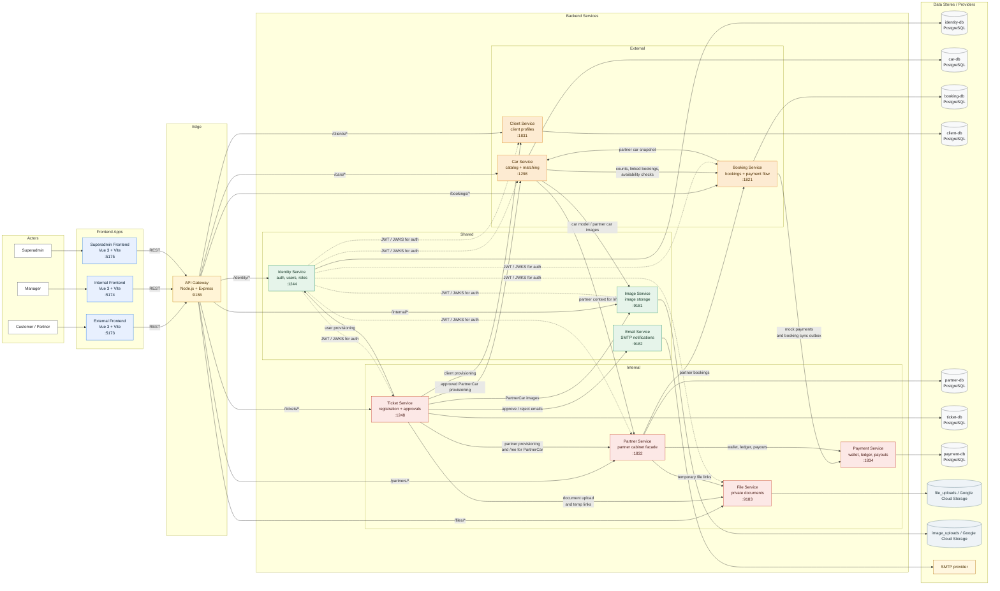

# AutoRent Project Architecture

Диаграмма ниже показывает runtime-контур проекта: 3 frontend-приложения, 11 backend-сервисов, их основные service-to-service вызовы, базы данных и внешние провайдеры. Миграционные контейнеры `*-flyway` намеренно опущены, чтобы не перегружать схему.

## Ключевые контуры

- `api-gateway` - единая входная точка для всех frontend-приложений; `payment-service` остаётся только внутренним сервисом и наружу не публикуется.
- `ticket-service` - главный orchestrator процесса onboarding и согласования: создаёт пользователей/профили, складывает документы, инициирует создание `partner_car` и отправляет email-уведомления.
- `car-service` и `booking-service` образуют контур подбора и доступности машин: каталог и ранжирование живут в `car-service`, фактическая занятость и статусы бронирований - в `booking-service`.
- `partner-service` выступает как фасад кабинета партнёра: агрегирует профиль, временные ссылки на документы, wallet/ledger/payouts и список бронирований.
- `identity-service` выдаёт JWT и публикует JWKS; остальные user-facing backend-сервисы валидируют пользовательские токены по публичному ключу.

## Основные пользовательские потоки

1. `Customer / Partner -> External Frontend -> API Gateway -> backend` для каталога, бронирований, регистрации и партнёрского кабинета.
2. `Manager -> Internal Frontend -> API Gateway -> Ticket Service` для очереди заявок, просмотра документов и approve/reject.
3. `Superadmin -> Superadmin Frontend -> API Gateway -> Identity Service` для управления пользователями, ролями и permission inheritance.
4. `Booking Service -> Payment Service` для mock-платежей и финансовой синхронизации статусов бронирования.
