# AutoRent Project Architecture

Диаграмма ниже показывает актуальный runtime-контур проекта: 3 frontend-приложения, 11 backend-сервисов, их синхронные и асинхронные взаимодействия, `RabbitMQ`, базы данных, объектные хранилища и observability-стек. Миграционные контейнеры `*-flyway` намеренно опущены, чтобы не перегружать схему.

```mermaid
flowchart TB
  classDef actor fill:#FFFFFF,stroke:#5F6368,color:#202124;
  classDef frontend fill:#E8F0FE,stroke:#1A73E8,color:#0B1F33;
  classDef edge fill:#FFF4D6,stroke:#C47F00,color:#4A2E00;
  classDef shared fill:#E6F4EA,stroke:#1E8E5A,color:#123524;
  classDef external fill:#FDEBD2,stroke:#D97706,color:#4D2E00;
  classDef internal fill:#FCE8E6,stroke:#C53929,color:#4A1C16;
  classDef data fill:#F8F9FA,stroke:#5F6368,color:#202124;
  classDef storage fill:#EEF3F7,stroke:#607D8B,color:#23343B;
  classDef provider fill:#FFF7E0,stroke:#B26A00,color:#4A2E00;
  classDef messaging fill:#FFF1D6,stroke:#B26A00,color:#4A2E00;
  classDef ops fill:#E8F5F2,stroke:#0F766E,color:#12332E;

  subgraph Actors["Actors"]
    direction LR
    CUSTOMER["Customer / Partner"]:::actor
    MANAGER["Manager"]:::actor
    SUPERADMIN["Superadmin"]:::actor
  end

  subgraph Frontend["Frontend Apps"]
    direction LR
    FE_EXT["External Frontend<br/>Vue 3 + Vite<br/>:5173"]:::frontend
    FE_INT["Internal Frontend<br/>Vue 3 + Vite<br/>:5174"]:::frontend
    FE_SUPER["Superadmin Frontend<br/>Vue 3 + Vite<br/>:5175"]:::frontend
  end

  subgraph Edge["Edge"]
    GATEWAY["API Gateway<br/>Node.js + Express<br/>HTTP :9186 / HTTPS :9443"]:::edge
  end

  subgraph Backend["Backend Services"]
    direction LR

    subgraph Shared["Shared"]
      direction TB
      IDENTITY["Identity Service<br/>auth, users, roles, JWKS<br/>:1244"]:::shared
      EMAIL["Email Service<br/>SMTP + RabbitMQ consumer<br/>:9182"]:::shared
      IMAGE["Image Service<br/>public image storage<br/>:9181"]:::shared
    end

    subgraph External["External"]
      direction TB
      CAR["Car Service<br/>catalog, /match, partner cars<br/>:1298"]:::external
      BOOKING["Booking Service<br/>bookings + mock payment UI<br/>:1821"]:::external
      CLIENT["Client Service<br/>client profiles<br/>:1831"]:::external
    end

    subgraph Internal["Internal"]
      direction TB
      PARTNER["Partner Service<br/>partner cabinet facade<br/>:1832"]:::internal
      TICKET["Ticket Service<br/>registration + approvals<br/>:1248"]:::internal
      PAYMENT["Payment Service<br/>wallet, ledger, payouts<br/>:1834"]:::internal
      FILE["File Service<br/>private documents<br/>:9183"]:::internal
    end
  end

  subgraph RuntimeData["Runtime Infra / Data Stores / Providers"]
    direction LR
    RABBIT["RabbitMQ<br/>events exchange + queues<br/>:5672 / :15672"]:::messaging
    ID_DB[("identity-db<br/>PostgreSQL")]:::data
    CAR_DB[("car-db<br/>PostgreSQL")]:::data
    BOOKING_DB[("booking-db<br/>PostgreSQL")]:::data
    CLIENT_DB[("client-db<br/>PostgreSQL")]:::data
    PARTNER_DB[("partner-db<br/>PostgreSQL")]:::data
    TICKET_DB[("ticket-db<br/>PostgreSQL")]:::data
    PAYMENT_DB[("payment-db<br/>PostgreSQL")]:::data
    FILE_STORE[("file_uploads / Google Cloud Storage")]:::storage
    IMAGE_STORE[("image_uploads / Google Cloud Storage")]:::storage
    SMTP["SMTP provider"]:::provider
  end

  subgraph Observability["Observability"]
    direction LR
    OTEL["OpenTelemetry Collector<br/>:4318"]:::ops
    PROM["Prometheus<br/>:9090"]:::ops
    PROMTAIL["Promtail"]:::ops
    TEMPO["Tempo<br/>:3200"]:::ops
    LOKI["Loki<br/>:3100"]:::ops
    GRAFANA["Grafana<br/>:3000"]:::ops
  end

  CUSTOMER --> FE_EXT
  MANAGER --> FE_INT
  SUPERADMIN --> FE_SUPER

  FE_EXT -->|REST / HTTPS| GATEWAY
  FE_INT -->|REST / HTTPS| GATEWAY
  FE_SUPER -->|REST / HTTPS| GATEWAY

  GATEWAY -->|/identity/*| IDENTITY
  GATEWAY -->|/cars/*| CAR
  GATEWAY -->|/bookings/*| BOOKING
  GATEWAY -->|/clients/*| CLIENT
  GATEWAY -->|/partners/*| PARTNER
  GATEWAY -->|/tickets/*| TICKET
  GATEWAY -->|/files/*| FILE
  GATEWAY -->|/internal/* public images| IMAGE

  TICKET -->|user provisioning| IDENTITY
  TICKET -->|client provisioning| CLIENT
  TICKET -->|partner provisioning<br/>and /me for PartnerCar| PARTNER
  TICKET -->|document upload<br/>and temp links| FILE
  TICKET -->|PartnerCar images| IMAGE
  TICKET ==>|ticket workflow outbox| RABBIT

  CAR -->|partner context for /my| PARTNER
  CAR -->|availability checks,<br/>counts, linked bookings| BOOKING
  CAR -->|car model / partner car images| IMAGE

  BOOKING -->|partner car snapshot| CAR
  BOOKING -->|mock payment sessions| PAYMENT
  BOOKING ==>|payment sync outbox| RABBIT

  PARTNER -->|temporary file links| FILE
  PARTNER -->|wallet, ledger, payouts| PAYMENT
  PARTNER -->|partner bookings| BOOKING

  RABBIT ==>|ticket email events| EMAIL
  RABBIT ==>|partner-car provisioning| CAR
  RABBIT ==>|booking payment events| PAYMENT

  IDENTITY -.->|JWT / JWKS for auth| CAR
  IDENTITY -.->|JWT / JWKS for auth| BOOKING
  IDENTITY -.->|JWT / JWKS for auth| CLIENT
  IDENTITY -.->|JWT / JWKS for auth| PARTNER
  IDENTITY -.->|JWT / JWKS for auth| TICKET
  IDENTITY -.->|JWT / JWKS for auth| FILE
  IDENTITY -.->|JWT / JWKS for auth| IMAGE

  IDENTITY --> ID_DB
  CAR --> CAR_DB
  BOOKING --> BOOKING_DB
  CLIENT --> CLIENT_DB
  PARTNER --> PARTNER_DB
  TICKET --> TICKET_DB
  PAYMENT --> PAYMENT_DB
  FILE --> FILE_STORE
  IMAGE --> IMAGE_STORE
  EMAIL --> SMTP

  GATEWAY -. traces .-> OTEL
  TICKET -. traces .-> OTEL
  IDENTITY -. traces .-> OTEL
  OTEL --> TEMPO

  GATEWAY -. metrics .-> PROM
  TICKET -. metrics .-> PROM
  IDENTITY -. metrics .-> PROM

  GATEWAY -. logs .-> PROMTAIL
  TICKET -. logs .-> PROMTAIL
  IDENTITY -. logs .-> PROMTAIL
  EMAIL -. logs .-> PROMTAIL
  PROMTAIL --> LOKI

  GRAFANA --> PROM
  GRAFANA --> LOKI
  GRAFANA --> TEMPO
```

## Ключевые контуры

- `api-gateway` - единственная внешняя точка входа для всех frontend-приложений; `payment-service`, `email-service`, `RabbitMQ` и базы данных наружу не публикуются. Публичный `/internal/*` у gateway используется только как прокси к `image-service`.
- `ticket-service` - синхронный orchestrator onboarding-потоков: создаёт пользователей/профили, складывает документы и изображения, а затем через outbox публикует workflow-события в `RabbitMQ` для email-уведомлений и provisioning партнерских машин.
- `car-service` и `booking-service` образуют контур подбора и доступности машин: каталог и ранжирование живут в `car-service`, фактическая занятость и статусы бронирований - в `booking-service`.
- `booking-service` и `payment-service` связаны двумя способами: mock payment flow для UI идёт по внутреннему HTTP, а финансовая синхронизация статусов `Confirmed / Canceled / Completed` идёт через outbox и `RabbitMQ`.
- `partner-service` выступает как фасад кабинета партнёра: агрегирует профиль, временные ссылки на документы, wallet/ledger/payouts и список бронирований.
- observability-стек (`Prometheus`, `Grafana`, `Loki`, `Tempo`, `OpenTelemetry Collector`, `Promtail`) подключён вместе с основным compose; сейчас edge metrics/traces дают `api-gateway`, а backend observability реализована в `ticket-service` и `identity-service`, при этом `Promtail` также собирает JSON-логи `email-service`.
- `identity-service` выдаёт JWT и публикует JWKS; остальные user-facing backend-сервисы валидируют пользовательские токены по публичному ключу.

## Основные пользовательские потоки

1. `Customer / Partner -> External Frontend -> API Gateway -> backend` для каталога, бронирований, регистрации и партнёрского кабинета.
2. `Manager -> Internal Frontend -> API Gateway -> Ticket Service` для очереди заявок, просмотра документов и approve/reject; после синхронных provisioning-вызовов `ticket-service` публикует события в `RabbitMQ`, которые подхватывают `email-service` и `car-service`.
3. `Superadmin -> Superadmin Frontend -> API Gateway -> Identity Service` для управления пользователями, ролями и permission inheritance.
4. `Customer -> External Frontend -> Booking Service -> Payment Service` для mock payment session (`start/submit`), после чего `booking-service` синхронизирует подтверждение, отмену и завершение брони в `payment-service` асинхронно через `RabbitMQ`.
5. `API Gateway / Ticket Service / Identity Service -> OpenTelemetry Collector / Prometheus / Promtail -> Tempo / Loki / Grafana` для трассировки, метрик и корреляции логов.
