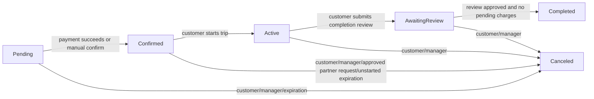

# Booking Workflow

This document describes the booking lifecycle based on the current implementation of `booking-service`.

## Source Files

The workflow was checked against these files:

- `backend/external/booking-service/src/BookingService.Domain/Enums/BookingStatus.cs`
- `backend/external/booking-service/src/BookingService.Domain/Entities/Booking.cs`
- `backend/external/booking-service/src/BookingService.Infrastructure/Services/BookingService.cs`
- `backend/external/booking-service/src/BookingService.Infrastructure/Services/PendingBookingExpirationDispatcher.cs`
- `backend/external/booking-service/src/BookingService.Infrastructure/Services/UnstartedBookingExpirationDispatcher.cs`
- `backend/external/booking-service/src/BookingService.Api/Controllers/BookingController.cs`
- `backend/external/booking-service/src/BookingService.Api/Controllers/InternalBookingsController.cs`

## Booking Statuses

The exact statuses are defined by the `BookingStatus` enum:

| Status | Meaning in the current workflow |
| --- | --- |
| `Pending` | Booking was created and is waiting for payment confirmation. |
| `Confirmed` | Payment was successfully submitted or booking was manually confirmed. |
| `Active` | Trip has been started by the customer. This is the implemented in-trip status. |
| `AwaitingReview` | Customer submitted the trip completion review with required photos, and the booking is waiting for manager/ticket review or pending charges. |
| `Completed` | Booking is fully completed after completion review approval and after there are no pending charges. |
| `Canceled` | Booking was canceled by customer, manager, approved partner cancellation request, or automatic expiration logic. |

There is no separate `InTrip` status in the code. The current equivalent is `Active`.

## Main Status Flow



The transition rules are enforced centrally in `TryApplyStatusTransition`:

- `Pending` can become `Confirmed` or `Canceled`.
- `Confirmed` can become `Active`, `Completed`, or `Canceled`.
- `Active` can become `AwaitingReview`, `Completed`, or `Canceled`.
- `AwaitingReview` can become `Completed` or `Canceled`.
- `Completed` and `Canceled` are terminal statuses.

## Booking Creation

A booking is created through `CreateBooking`. Before persistence, the service validates the user, date range, dynamic price quote, car availability, and overlapping user bookings.

The booking is inserted with:

```csharp
Status = BookingStatus.Pending
```

After creation, the service tries to eagerly start a mock payment session. If this fails, checkout can start the payment again later.

## Availability Check

Availability is checked before creating a booking. The service rejects creation when the same partner car has an overlapping booking in one of these statuses:

- `Pending`
- `Confirmed`
- `Active`

The same overlap logic is also applied to the current user's own bookings, so a user cannot create overlapping bookings for the same period.

`AwaitingReview`, `Completed`, and `Canceled` are not treated as blocking statuses for the car availability check.

## Payment and Confirmation

The normal confirmation path is payment-based:

1. Booking starts as `Pending`.
2. Customer starts or continues a mock payment session.
3. Customer submits payment details.
4. If payment status is `succeeded`, booking changes from `Pending` to `Confirmed`.

There is also a direct `POST /{id}/confirm` endpoint that calls `ConfirmBooking`. In the current code it can confirm a user's booking without checking payment result inside that method, so for documentation it should be described as a manual or legacy confirmation endpoint rather than the main business flow.

## Trip Start

The trip starts through `POST /{id}/start`.

The service checks that the user is allowed to perform booking actions and that the current time is within 15 minutes before the booking start time. Then it sets `TripStartedAt` if it was not already set and moves the booking to `Active`.

## Completion Flow

The plain `POST /{id}/complete` endpoint exists, but it does not complete the booking in the current implementation. It throws an error saying that completion requires the completion review form with required photos.

The real completion flow is:

1. Booking must be `Active`.
2. Customer submits `POST /{id}/complete-review` with required completion photos.
3. The service validates the submission, runs AI damage assessment, creates a completion review ticket, stores `TripCompletedAt`, and changes booking status to `AwaitingReview`.
4. Internal ticket workflow calls one of the internal completion-review endpoints.
5. If the review is approved and there are no pending payment charges, booking becomes `Completed`.
6. If a fine is issued, booking remains `AwaitingReview` until pending charges are paid. After all charges are paid, the booking becomes `Completed`.

## Cancellation Flow

Cancellation can happen through several paths:

| Actor/path | How it works |
| --- | --- |
| Customer | `POST /{id}/cancel` calls `CancelBooking` for the authenticated user's own booking. The central transition rules allow cancellation from `Pending`, `Confirmed`, `Active`, and `AwaitingReview`. |
| Manager/admin | `POST /all/{id}/cancel` with `bookings:update` permission, or internal `POST /internal/bookings/{id}/cancel`, calls `CancelBookingByAdmin`. It can cancel any non-terminal booking. |
| Partner | Public route `POST /{id}/partner-cancel` does not immediately cancel the booking. It creates a partner cancellation review ticket and is allowed only for `Pending` or `Confirmed` bookings. If the internal manager/ticket workflow approves the request, the booking becomes `Canceled`. |
| System expiration | Pending bookings older than the configured TTL are automatically canceled by `PendingBookingExpirationDispatcher`. Confirmed bookings that were never started before their end time are automatically canceled by `UnstartedBookingExpirationDispatcher`. |

The service class also contains a direct `CancelBookingByPartner` method, but the exposed controller route uses the safer review-ticket flow through `RequestPartnerCancellation`.

## Direct Answers

1. **Какие точные статусы есть у booking?**
   `Pending`, `Confirmed`, `Active`, `AwaitingReview`, `Completed`, `Canceled`.

2. **В каком статусе создаётся booking?**
   Booking создаётся в статусе `Pending`.

3. **Когда booking становится Confirmed?**
   В основном workflow booking становится `Confirmed`, когда mock payment успешно отправлен и payment-service возвращает статус `succeeded`. Также есть прямой endpoint `POST /{id}/confirm`, который переводит booking в `Confirmed`, но его лучше описывать как manual/legacy confirmation path.

4. **Есть ли статус Active/InTrip?**
   Есть статус `Active`. Отдельного статуса `InTrip` нет. `Active` выполняет роль in-trip status.

5. **Когда booking становится Completed?**
   После завершения поездки customer отправляет completion review, booking становится `AwaitingReview`, затем internal completion-review workflow переводит booking в `Completed`, если review approved и нет pending charges. Если есть fine/late penalty, booking станет `Completed` после оплаты всех pending charges.

6. **Когда booking становится Canceled?**
   Booking становится `Canceled` при отмене customer, manager/admin, после approved partner cancellation request, при expiration `Pending` booking по TTL, или когда `Confirmed` booking не был started до end time.

7. **Проверяется ли availability перед созданием booking?**
   Да. Перед созданием проверяются overlaps для partner car и для текущего пользователя. Блокирующие статусы: `Pending`, `Confirmed`, `Active`.

8. **Кто может отменить booking: customer, partner, manager?**
   Customer может отменить свой booking напрямую через `POST /{id}/cancel`. Manager/admin может отменить non-terminal booking через admin/internal endpoints. Partner через публичный route не отменяет напрямую, а создаёт cancellation request ticket для `Pending` или `Confirmed`; booking отменяется только после approval во внутреннем workflow.
