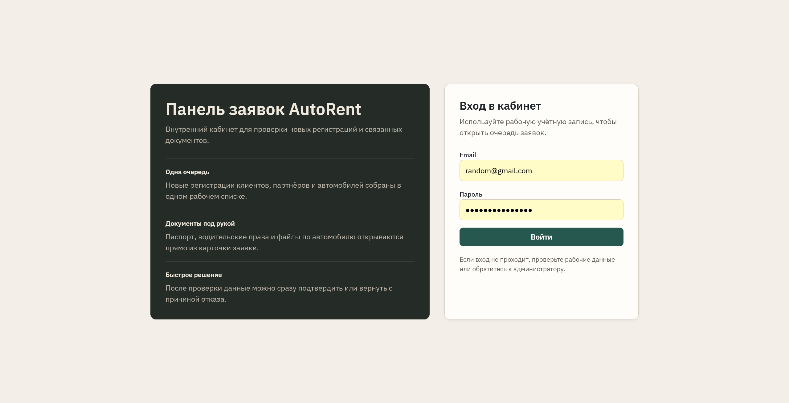
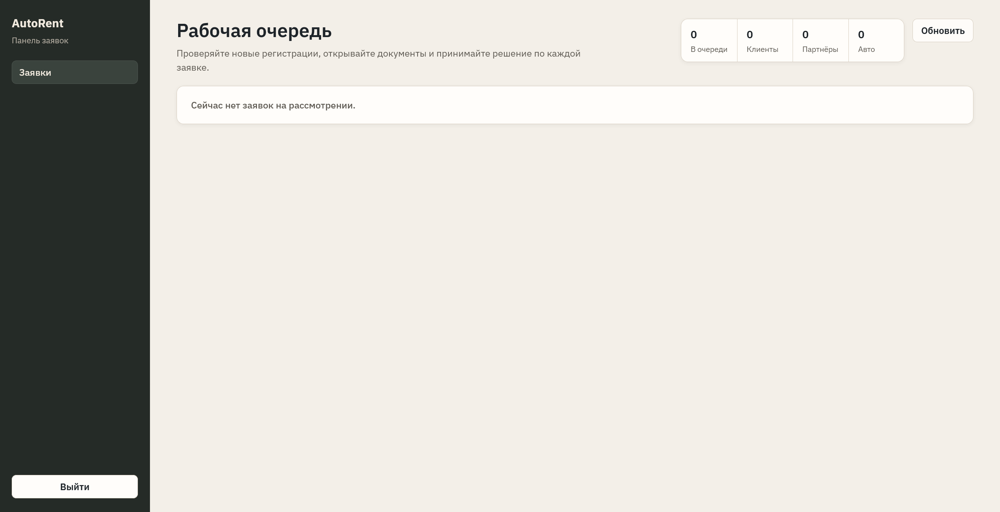
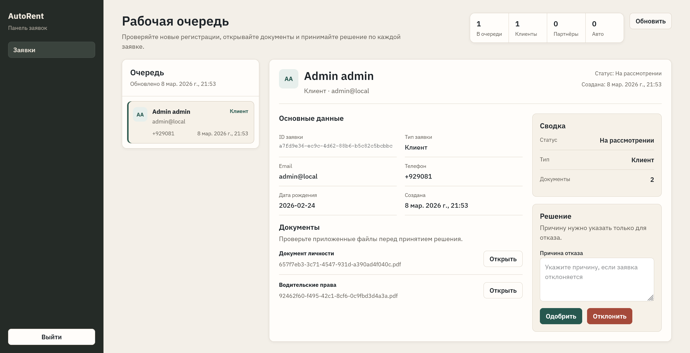

# AutoRent Internal Frontend

Внутренний интерфейс менеджера для обработки регистрационных заявок в AutoRent. Приложение покрывает вход в кабинет, очередь заявок и карточку проверки с документами и действиями по approve/reject.

## Что есть в интерфейсе

- экран входа в кабинет;
- рабочая очередь с быстрым обзором по типам заявок;
- карточка заявки с данными пользователя;
- просмотр документов и фотографий автомобиля;
- одобрение и отклонение заявки с причиной отказа;
- редактирование данных автомобиля для заявок типа `PartnerCar`.

## Скриншоты

### Вход



### Очередь заявок



### Карточка заявки



## Стек

- Vue 3
- TypeScript
- Vite
- Vue Router
- Axios

## Основные маршруты

- `/login`
- `/tickets`

Маршрут `/tickets` открывается только для авторизованного пользователя. Для корректной работы раздела нужны права:

- `Ticket.View`
- `Ticket.Approve`
- `Ticket.Reject`

## Интеграция с API Gateway

Базовый URL API задаётся через `VITE_API_URL`.

Основные вызовы:

- `POST /identity/auth/login`
- `GET /tickets/pending`
- `GET /tickets/{id}`
- `GET /tickets/{id}/documents/{identity|license|ownership}/temporary-link`
- `POST /tickets/{id}/approve`
- `POST /tickets/{id}/reject`

## Переменные окружения

См. [`./.env.example`](./.env.example):

- `VITE_API_URL` - адрес API Gateway
- `VITE_APP_NAME` - название приложения
- `VITE_TOKEN_EXPIRY_HOURS` - срок жизни токена в часах

## Запуск

### Локально

Из директории `frontend/internal`:

```bash
npm ci
npm run dev
```

Приложение по умолчанию доступно на `http://localhost:5174`.

### Проверка типов и production build

Из директории `frontend/internal`:

```bash
npm run type-check
npm run build
```

### Через compose только для internal frontend

Из директории `frontend/internal`:

```bash
docker compose up --build
```

### В составе всего проекта

Из корня репозитория:

```bash
docker compose up --build internal-frontend
```
