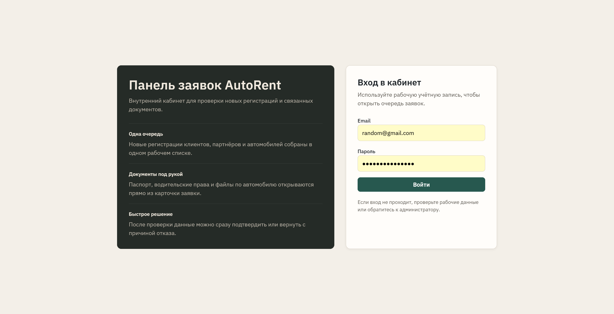
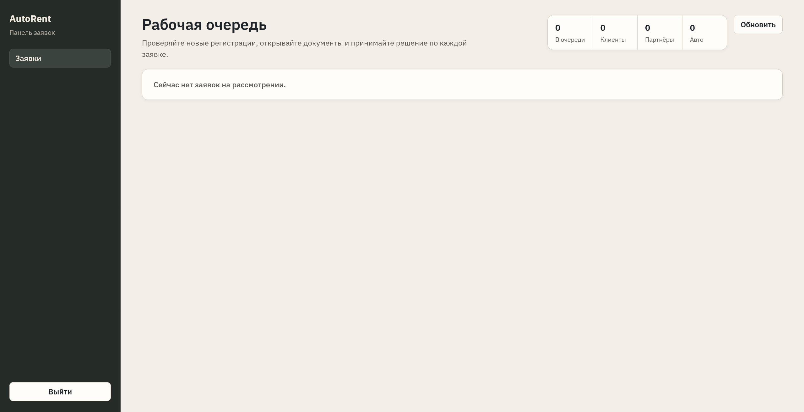
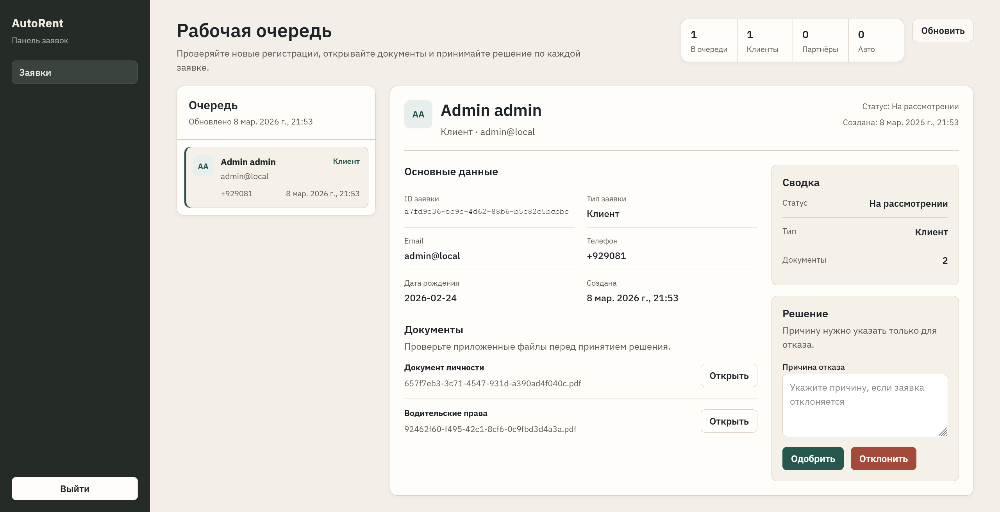

# AutoRent Internal Frontend

Внутренний интерфейс менеджера для операционной работы AutoRent. Приложение покрывает вход в кабинет, очередь заявок, справочники клиентов/партнеров/машин, бронирования, жалобы, финансы, чаты и карточки проверки с действиями по approve/reject.

## Что есть в интерфейсе

- экран входа в кабинет;
- рабочая очередь с быстрым обзором по типам заявок;
- карточка заявки с данными пользователя, документами и фотографиями;
- просмотр документов и фотографий автомобиля;
- одобрение и отклонение заявки с причиной отказа;
- редактирование данных автомобиля для заявок типа `PartnerCar`.
- таблицы клиентов, партнеров, машин и бронирований;
- очередь жалоб, access requests и booking review;
- advisory-блок AI-оценки повреждений для completion review;
- чат по контексту жалобы/бронирования с вложениями;
- финансовый экран и просмотр charges по бронированию;
- административная панель пользователей/ролей внутри internal UI.

## Скриншоты

### Вход



### Очередь заявок



### Карточка заявки



## Стек

- Vue 3
- TypeScript
- Vite
- Vue Router
- Axios

## Основные маршруты

- `/login`
- `/tickets`
- `/clients`
- `/clients/:id`
- `/partners`
- `/partners/:id`
- `/cars`
- `/cars/:id`
- `/bookings`
- `/bookings/:id`
- `/complaints`
- `/complaints/access-requests`
- `/complaints/:id`
- `/complaints/:complaintId/booking-review`
- `/finance`
- `/super`
- `/super/managers/:id`
- `/admin`

Маршруты открываются только для авторизованного пользователя и дополнительно проверяют permissions:

- `Ticket.View`
- `Ticket.Approve`
- `Ticket.Reject`
- `Ticket.ViewAll`
- `Client.View`
- `Partner.View`
- `PartnerCar.View`
- `Booking.View`
- `Complaint.View`
- `Complaint.Review`
- `AccessRequest.Review`
- `Payment.View`
- `User.View`

## Интеграция с API Gateway

Базовый URL API задаётся через `VITE_API_URL`.

Основные вызовы:

- `POST /identity/auth/login`
- `GET /tickets/pending`
- `GET /tickets/{id}`
- `GET /tickets/{id}/documents/{identity|license|ownership}/temporary-link`
- `POST /tickets/{id}/approve`
- `POST /tickets/{id}/reject`
- `GET /clients`
- `GET /partners`
- `GET /cars/partner-cars`
- `GET /bookings/all`
- `GET /bookings/all/{id}`
- `GET /payments/view/bookings/{bookingId}/charges`
- `GET /tickets/complaints/all`
- `GET /tickets/complaints/all/{id}`
- `POST /tickets/complaints/all/{id}/resolve`
- `POST /tickets/complaints/all/{id}/reject`
- `GET /tickets/complaints/{complaintId}/booking-review`
- `GET /tickets/complaints/access-requests`
- `GET /chat/conversations/by-context/{contextType}/{contextId}`
- `POST /chat/conversations/{conversationId}/messages`
- `GET /identity/users`
- `GET /identity/roles`

## Переменные окружения

См. [`./.env.example`](./.env.example):

- `VITE_API_URL` - адрес API Gateway
- `VITE_APP_NAME` - название приложения
- `VITE_TOKEN_EXPIRY_HOURS` - срок жизни токена в часах

## Запуск

### Локально

Из директории `frontend/internal`:

```bash
npm ci
npm run dev
```

Приложение по умолчанию доступно на `http://localhost:5174`.

### Проверка типов и production build

Из директории `frontend/internal`:

```bash
npm run type-check
npm run build
```

### Через compose только для internal frontend

Из директории `frontend/internal`:

```bash
docker compose up --build
```

### В составе всего проекта

Из корня репозитория:

```bash
docker compose up --build internal-frontend
```
